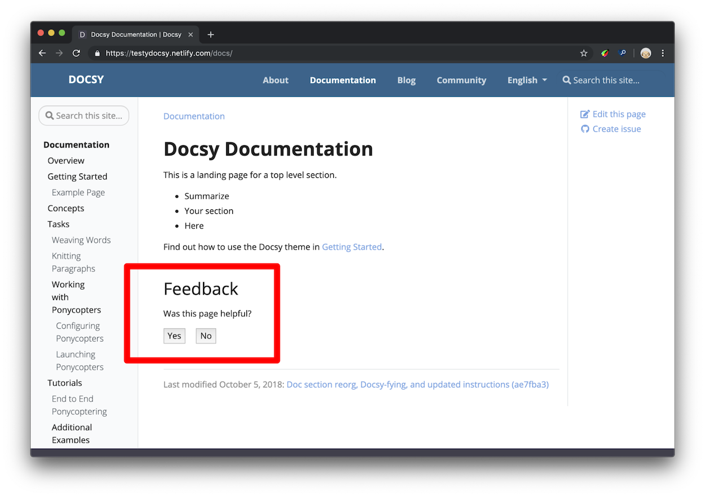

+++
title = "分析、用户反馈和SEO"
weight = 8
date = 2023-05-18T17:03:08+08:00
description = ""
isCJKLanguage = true
draft = false
+++

# Analytics, User Feedback, and SEO - 分析、用户反馈和SEO

https://www.docsy.dev/docs/adding-content/feedback/

​	为您的站点添加Google Analytics跟踪，收集用户反馈并了解页面描述元标记。 


## 添加分析

​	Docsy 主题基于 [Hugo 对 Google Analytics 的支持](https://gohugo.io/templates/internal/#google-analytics)，Hugo 通过 [内部模板](https://gohugo.io/templates/internal/) 提供支持。一旦您按照下面的说明设置了分析，您的网站使用信息（如页面浏览量）将发送到您的 [Google Analytics](https://analytics.google.com/analytics/web/) 账户。

### 先决条件 

​	在继续之前，您需要为您的网站获取一个 **分析 ID**（技术上称为测量 ID 或属性 ID，但在本指南中我们将使用"analytics ID（分析 ID）"这个术语）。如果您还没有分析 ID，请参见 [介绍 Google Analytics 4 (GA4)](https://support.google.com/analytics/answer/1042508) 的 **入门指南** 部分。

> 提示
>
> ​	您的项目的 **分析 ID** 是以 `G-`（GA4 测量 ID）或 `UA-`（通用分析属性 ID）开头的字符串。

### 设置 

​	通过将项目的分析 ID 添加到站点配置文件中来启用 Google Analytics。有关详细信息，请参见 [配置 Google Analytics](https://gohugo.io/templates/internal/#configure-google-analytics)。

​	默认情况下，Docsy 主题使用 [gtag.js](https://support.google.com/analytics/answer/10220869) 分析库来支持 GA4（它 *需要* `gtag.js`）和通用分析（UA）站点标签。如果您更喜欢在您的 UA 站点标签中使用较旧的 `analytics.js` 库，则在您的项目 [配置文件](https://gohugo.io/getting-started/configuration/#configuration-file) 中设置 `params.disableGtagForUniversalAnalytics` 为 `true`。

Configuration file:

=== "hugo.yaml"

    ```yaml
    params:
      disableGtagForUniversalAnalytics: true
    ```

=== "hugo.toml"

    ```toml
    [params]
    disableGtagForUniversalAnalytics = true
    ```

=== "hugo.json"

    ```json
    {
      "params": {
        "disableGtagForUniversalAnalytics": true
      }
    }
    ```


> 警告 
>
> ​	您可以通过设置顶层 `googleAnalytics` 配置参数或 `services.googleAnalytics.id` 来配置项目的分析 ID。**不要同时定义这两个参数**，否则可能会导致[意外行为](https://github.com/google/docsy/issues/921)。有关详细信息，请参见 [Is services.googleAnalytics.id an alias for googleAnalytics](https://discourse.gohugo.io/t/config-is-services-googleanalytics-id-an-alias-for-googleanalytics/39469)。

> Production-only feature! 仅限于生产环境！
>
> ​	分析仅在**生产环境**（在 Hugo 术语中称为"环境（environments）"）中启用。有关 Hugo 环境及如何设置它们的信息，请参见以下 [讨论](https://discourse.gohugo.io/t/what-does-setting-hugo-env-to-production-do/24669/2)。

## 用户反馈 

​	默认情况下，Docsy 在每个文档页面底部放置一个"was this page helpful?"的反馈小部件，如图1所示。



图1. 反馈小部件，用红线勾勒出来。 

​	点击"Yes"后，用户应该会看到类似图2的响应。您可以在项目的 [配置文件](https://gohugo.io/getting-started/configuration/#configuration-file) `hugo.toml` 中[配置](https://www.docsy.dev/docs/adding-content/feedback/#setup-1)响应文本。


​	图2. 一个"Yes"响应的示例。

### 这些数据有什么用处？ 

​	当您有大量文档，且没有足够的时间更新所有文档时，您可以使用"was this page helpful?" 的反馈数据来帮助您决定哪些页面需要优先考虑。通常，从访问量高且评级低的页面开始。在此上下文中，"Low ratings"意味着用户更经常地点击**No**——页面不够有用——而不是**Yes**——页面有用。您还可以研究您评级高的页面，以制定关于为什么您的用户认为它们有用的假设。

​	一般来说，如果可能的话，您可以在文档中引入孤立的更改，以更加确定用户喜欢或不喜欢的模式。例如，假设您发现一个教程不再匹配产品。您更新了说明，一个月后再次检查，分数已经提高。现在您有了最新说明和更高评分之间的相关性。或者，假设您研究了高评分页面，并发现它们都以代码示例开头。您找到另外10个代码示例在底部的页面，将示例移动到顶部，发现每个页面的分数都有所提高。由于这是您在每个页面上引入的唯一更改，因此更有理由相信您的用户发现页面顶部的代码示例有帮助。换句话说，这是将科学方法应用于技术写作！

###  Setup 设置 

1. 打开`hugo.toml`/`hugo.yaml`/`hugo.json`。

3. 确保启用了谷歌分析，[如上所述](https://www.docsy.dev/docs/adding-content/feedback/#setup)。

3. 设置用户在点击**Yes**或**No**后看到的响应文本。

   Configuration file:

=== "hugo.yaml"

	```yaml
       params:
         ui:
           feedback:
             enable: true
             'yes': >-
               Glad to hear it! Please <a href="https://github.com/USERNAME/REPOSITORY/issues/new">
               tell us how we can improve</a>.        
             'no': >-
               Sorry to hear that. Please <a href="https://github.com/USERNAME/REPOSITORY/issues/new">
               tell us how we can improve</a>.  
	```

=== "hugo.toml"

	```toml
       [params.ui.feedback]
       enable = true
       yes = 'Glad to hear it! Please <a href="https://github.com/USERNAME/REPOSITORY/issues/new">tell us how we can improve</a>.'
       no = 'Sorry to hear that. Please <a href="https://github.com/USERNAME/REPOSITORY/issues/new">tell us how we can improve</a>.'
	```

=== "hugo.json"

	```json
       {
         "params": {
           "ui": {
             "feedback": {
               "enable": true,
               "yes": "Glad to hear it! Please <a href=\"https://github.com/USERNAME/REPOSITORY/issues/new\"> tell us how we can improve</a>.",
               "no": "Sorry to hear that. Please <a href=\"https://github.com/USERNAME/REPOSITORY/issues/new\"> tell us how we can improve</a>."
             }
           }
         }
       }
	```

   

7. 保存并关闭 `hugo.toml`/`hugo.yaml`/`hugo.json`。


### 访问反馈数据 

​	本节假设您基本熟悉Google Analytics。例如，您应该知道如何检查某个时间范围内的页面浏览量，并在访问多个文档站点的情况下在帐户之间导航。

1. 打开 Google Analytics。 
3. 打开 **Behavior** > **Events** > **Overview**。 
5. 在**Event Category**表中点击 **Helpful** 行。如果看不到 **Helpful** 行，请点击**view full report**。 
7. 点击**Event Label**。现在您可以按页面对评级进行详细分类。 

​	以下是这四列的含义：

- **Total Events**是用户点击 **Yes** 或 **No** 的总次数。 
- **Unique Events**提供了一个粗略的指标，用于指示用户在每个会话中评价您的页面的频率。例如，假设您的**Total Events**为5000，而**Unique Events**为2500。这意味着您有 2500 个用户每个会话对 2 个页面进行评级。 
- **Event Value** 并不是非常有用。 
- **Avg. Value** 是该页面的聚合评级。该值始终在 0 和 1 之间。当用户点击 **No** 时，会发送值 0 到 Google Analytics。当用户点击 **Yes** 时，会发送值 1。您可以将其视为百分比。如果某个页面的 **Avg. Value** 为 0.67，则表示有 67% 的用户点击了 **Yes**，33% 的用户点击了 **No**。 

​	存储"was this page helpful?"数据的基础 Google Analytics 基础架构称为[事件（Events）](https://developers.google.com/analytics/devguides/collection/analyticsjs/events)。查看 [docsy pull request #1](https://github.com/google/docsy/pull/1/files) 来了解用户单击 **Yes** 或 **No** 按钮时发生的确切事件。这只是一个`click`事件监听器，触发了 Google Analytics 的 JavaScript 函数来记录事件、禁用 **Yes** 和 **No** 按钮，并显示响应文本。

### 在单个页面上禁用反馈 

​	在页面的前置元数据中添加 `hide_feedback` 参数并将其设置为 `true`。

Front matter:

=== "yaml"

    ```yaml
    ---
    hide_feedback: true
    ---
    ```

=== "toml"

    ```toml
    +++
    hide_feedback = true
    +++
    ```

=== "json"

    ```json
    {
        "hide_feedback": true
    }
    ```


### 在所有页面上禁用反馈 

​	在 `hugo.toml`/`hugo.yaml`/`hugo.json` 中将 `params.ui.feedback.enable` 设置为 `false`：

Configuration file:

=== "hugo.yaml"

    ```yaml
    params:
      ui:
        feedback:
          enable: false
    ```

=== "hugo.toml"

    ```toml
    [params.ui.feedback]
    enable = false
    ```

=== "hugo.json"

    ```json
    {
      "params": {
        "ui": {
          "feedback": {
            "enable": false
          }
        }
      }
    }
    ```

## 使用 Fabform 添加联系表单 

​	您可以为您的站点创建一个联系表单，并在 [fabform.io](https://fabform.io/) 上收集您的表单提交。要使用此功能，您首先需要在 Fabform 上注册一个帐户。以下示例显示如何将收集用户电子邮件地址的简单表单添加到您的站点源代码中：

```html
<form action="https://fabform.io/f/{form-id}" method="post">
 <label for="email">Your Email</label>
 <input name="email" type="email">
 <button type="submit">Submit</button>
</form>
```

​	有关更多详细信息，请参见 Fabform 文档中的[添加 Hugo 联系表单](https://fabform.io/a/hugo-contact-form)。

## 搜索引擎优化元标签 

​	要了解如何优化您的站点以进行SEO，请参见[搜索引擎优化（SEO）入门指南](https://developers.google.com/search/docs/beginner/seo-starter-guide)。

​	Google[建议](https://developers.google.com/search/docs/beginner/seo-starter-guide?hl=en%2F#descriptionmeta)使用`description`元标签告诉搜索引擎您的页面内容。对于每个生成的页面，Docsy将使用以下第一个定义的内容来设置元`description`的内容：

- 该页面`description`[前置元数据字段](https://www.docsy.dev/docs/adding-content/content/#page-frontmatter) 
- 对于非索引页面，由Hugo计算得出的页面[摘要](https://gohugo.io/content-management/summaries/) 
- 从[站点参数](https://gohugo.io/variables/site/#the-siteparams-variable)中获取的站点描述 

​	有关用于执行此计算的模板代码，请参见layouts/partials/page-description.html。

​	有关用于执行此计算的模板代码，请参见 [layouts/partials/page-description.html](https://github.com/google/docsy/blob/main/layouts/partials/page-description.html)。

​	根据需要向项目的 `head-end.html` partial 中添加更多的元标签。有关详情，请参见 [自定义模板](https://www.docsy.dev/docs/adding-content/lookandfeel/#customizing-templates)。
