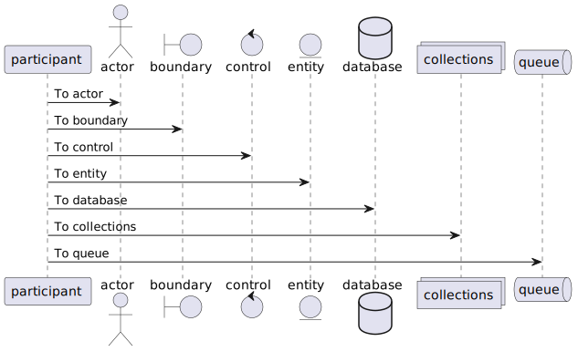

+++
title = "图表和公式"
weight = 11
date = 2023-05-18T17:03:08+08:00
description = ""
isCJKLanguage = true
draft = false
+++

# Diagrams and Formulae - 图表和公式 

[https://www.docsy.dev/docs/adding-content/diagrams-and-formulae/](https://www.docsy.dev/docs/adding-content/diagrams-and-formulae/)

​	在您的站点中添加生成的图表和科学公式。

​	Docsy内置支持多个图表创建和排版工具，您可以使用这些工具向您的站点添加丰富的内容，包括KaTeX、Mermaid、Diagrams.net、PlantUML和MarkMap。

## 使用 KaTeX 支持 LaTeX 

​	[LaTeX](https://www.latex-project.org/)是一种高质量的排版系统，用于制作技术和科学文档。由于其出色的数学排版能力，TeX成为了科学文档的沟通和出版的事实标准，特别是如果这些文档包含大量数学公式。LaTeX由Donald Knuth设计和主要编写，最初的版本于1978年发布。由于其起始时间很早，LaTeX的主要输出目标是`pdf`，并不特别适合生成Web的HTML输出。幸运的是，有一个快速易用的JavaScript库，即[ KaTeX](https://katex.org/)，可以用于在Web上呈现TeX数学公式，它已经集成到Docsy主题中。

​	通过在Docsy中[启用](https://www.docsy.dev/docs/adding-content/diagrams-and-formulae/#activating-and-configuring-katex-support)KaTeX支持，您可以将复杂的数学公式嵌入到网页中，以行内或独立的方式居中显示。由于KaTeX依赖于服务器端渲染，因此它会生成相同的输出，无论您的浏览器或环境如何。公式可以以行内或显示模式显示：

### 内联公式 

​	以下代码示例生成一个带有三个内联公式的文本行：

```tex
When \\(a \ne 0\\), there are two solutions to \\(ax^2 + bx + c= 0\\) and they are \\(x = {-b \pm \sqrt{b^2-4ac} \over 2a}\\).
```


### 显示模式的公式 

​	以下代码示例生成一个介绍性文本行，后跟一个编号为`(1)`的单独行上的公式：

~~~markdown
The probability of getting \\(k\\) heads when flipping \\(n\\) coins is:
```math
\tag*{(1)} P(E) = {n \choose k} p^k (1-p)^{n-k}
```
~~~

​	该公式本身写在 [GLFM 数学块](https://docs.gitlab.com/ee/user/markdown.html#math)中。上面的代码片段渲染为：


> 警告
>
> ​	`math` 代码块仅在 Hugo 版本 0.93 及以上版本中受支持。
>
> ​	在 Hugo 版本 0.92 或更低版本的情况下，请使用此代码段显示公式：
>
> ```tex
> $$
> \tag*{(1)} P(E) = {n \choose k} p^k (1-p)^{n-k}
> $$
> ```


>
>提示 
>
>​	这个[维基页面](https://en.wikibooks.org/wiki/LaTeX/Mathematics)提供了有关使用 LaTeX 排版系统排版数学公式的详细信息。

### 激活和配置 KaTeX 支持

#### 自动激活 

​	只要在页面上使用 `math` 代码块，KaTeX 支持就会自动启用。

#### 手动激活（没有 `math` 代码块存在或使用的是 hugo 0.92 或更低版本）

​	如果你想使用内联公式，并且在页面上没有 `math` 代码块触发自动激活，那么你需要手动激活 KaTeX 支持。最简单的方法是在页面的前置元数据中添加一个 `math` 属性，并将其设置为 `true`：

Page front matter:

=== "yaml"

    ```yaml
    ---
    math: true
    ---
    ```

=== "toml"

    ```toml
    +++
    math = true
    +++
    ```

=== "json"

    ```json
    {
      "math": true
    }
    ```


​	如果你在大多数页面中使用公式，你也可以在 Docsy 主题中启用站点范围的 KaTeX 支持。要这样做，请更新 `hugo.toml`/`hugo.yaml`/`hugo.json`：

Site configuration file:

=== "hugo.yaml"

    ```yaml
    params:
      katex:
        enable: true
    ```

=== "hugo.toml"

    ```toml
    [params.katex]
    enable = true
    ```

=== "hugo.json"

    ```json
    {
      "params": {
        "katex": {
          "enable": true
        }
      }
    }
    ```


​	此外，如果需要，还可以在 `hugo.toml`/`hugo.yaml`/`hugo.json` 中自定义各种 KaTeX 选项：

Site configuration file:

=== "hugo.yaml"

    ```yaml
    params:
      katex:
        enable: true  # enable/disable KaTeX support
        html_dom_element: document.body  # Element(s) scanned by auto render extension. Default: document.body
        options:
    
          # If true (the default), KaTeX will throw a ParseError when it encounters an
          # unsupported command or invalid LaTeX. If false, KaTeX will render unsupported
          # commands as text, and render invalid LaTeX as its source code with hover text
          # giving the error, in the color given by errorColor.
          throwOnError: false
          errorColor: '#CD5C5C'
    
          # This is a list of delimiters to look for math, processed in the same order as
          # the list. Each delimiter has three properties:
          #   left:    A string which starts the math expression (i.e. the left delimiter).
          #   right:   A string which ends the math expression (i.e. the right delimiter).
          #   display: Whether math in the expression should be rendered in display mode.
          delimiters:
            - left: $$
              right: $$
              display: true
            - left: $
              right: $
              display: false
            - left: \(
              right: \)
              display: false
            - left: \[
              right: \]
              display: true
    ```

=== "hugo.toml"

    ```toml
    [params.katex]
    # enable/disable KaTeX support
    enable = true
    # Element(s) scanned by auto render extension. Default: document.body
    html_dom_element = "document.body"
    
    [params.katex.options]
    # If true (the default), KaTeX will throw a ParseError when it encounters an
    # unsupported command or invalid LaTeX. If false, KaTeX will render unsupported
    # commands as text, and render invalid LaTeX as its source code with hover text
    # giving the error, in the color given by errorColor.
    throwOnError = false
    errorColor = "#CD5C5C"
    
    # This is a list of delimiters to look for math, processed in the same order as
    # the list. Each delimiter has three properties:
    #   left:    A string which starts the math expression (i.e. the left delimiter).
    #   right:   A string which ends the math expression (i.e. the right delimiter).
    #   display: Whether math in the expression should be rendered in display mode.
    [[params.katex.options.delimiters]]
      left = "$$"
      right = "$$"
      display = true
    [[params.katex.options.delimiters]]
      left = "$"
      right = "$"
      display = false
    [[params.katex.options.delimiters]]
      left = "\\("
      right = "\\)"
      display = false
    [[params.katex.options.delimiters]]
      left = "\\["
      right = "\\]"
      display = true
    ```

=== "hugo.json"

    ```json
    {
      "params": {
        "katex": {
          "enable": true,
          "html_dom_element": "document.body",
          "options": {
            "throwOnError": false,
            "errorColor": "#CD5C5C",
            "delimiters": [
              {
                "left": "$$",
                "right": "$$",
                "display": true
              },
              {
                "left": "$",
                "right": "$",
                "display": false
              },
              {
                "left": "\\(",
                "right": "\\)",
                "display": false
              },
              {
                "left": "\\[",
                "right": "\\]",
                "display": true
              }
            ]
          }
        }
      }
    }
    ```


​	完整的选项列表及其详细描述，请查看 KaTeX 的 [Rendering API options](https://katex.org/docs/autorender.html#api) 和 [configuration options](https://katex.org/docs/options.html) 文档。

### 化学方程式和物理单位的显示 

​	[mhchem](https://www.ctan.org/pkg/mhchem) 是一个 LaTeX 包，用于排版化学分子式和方程式。幸运的是，KaTeX 提供了 `mhchem` [扩展](https://github.com/KaTeX/KaTeX/tree/main/contrib/mhchem)，使得在编写 web 内容时能够使用 `mhchem` 包。[启用](https://www.docsy.dev/docs/adding-content/diagrams-and-formulae/#activating-rendering-support-for-chemical-formulae) `mhchem` 扩展后，您可以轻松地将化学方程式包含在您的页面中，方程式可以以行内或独立行的形式显示。以下代码示例生成一个包含化学方程式的文本行：

```mhchem
*Precipitation of barium sulfate:* \\(\ce{SO4^2- + Ba^2+ -> BaSO4 v}\\)
```


硫酸钡的沉淀： 

​	更复杂的方程式需要单独占据一行。使用附有 `chem` 的代码块即可实现此目的：

~~~markdown
```chem
\tag*{(2)} \ce{Zn^2+  <=>[+ 2OH-][+ 2H+]  $\underset{\text{amphoteric hydroxide}}{\ce{Zn(OH)2 v}}$  <=>[+ 2OH-][+ 2H+]  $\underset{\text{tetrahydroxozincate}}{\ce{[Zn(OH)4]^2-}}$}
```
~~~


> Warning
>
> ​	`chem` 代码块仅在 Hugo 版本 0.93 及以上版本中受支持。
>
> ​	在 hugo 版本 0.92 或更低版本中，使用此代码片段来显示公式：
>
> ```tex
> $$
> \tag*{(2)} \ce{Zn^2+  <=>[+ 2OH-][+ 2H+]  $\underset{\text{amphoteric hydroxide}}{\ce{Zn(OH)2 v}}$  <=>[+ 2OH-][+ 2H+]  $\underset{\text{tetrahydroxozincate}}{\ce{[Zn(OH)4]^2-}}$}
> $$
> ```

> Note
>
> [mchem 的手册](https://mhchem.github.io/MathJax-mhchem/) 提供了使用 `mhchem` 工具排版化学式和物理单位的输入语法的详细信息。

​	使用 `mhchem` 并不仅限于编写化学方程式，通过包含的 `\pu` 命令，也可以轻松地编写漂亮的物理单位。下面的代码示例生成了两行带有四个数字及其对应物理单位的文本：

```mhchem
* Scientific number notation: \\(\pu{1.2e3 kJ}\\) or \\(\pu{1.2E3 kJ}\\) \\
* Divisions: \\(\pu{123 kJ/mol}\\) or \\(\pu{123 kJ//mol}\\)
```


​	要查看有关编写物理单位的所有选项，请查看 `mhchem` 文档中的 [物理单位章节](https://mhchem.github.io/MathJax-mhchem/#pu)。

#### 激活化学公式的渲染支持

##### 自动激活 

​	只要在页面上使用了 `chem` 代码块，就会自动启用化学公式的渲染支持。

##### 手动激活（没有 `chem` 代码块存在或使用的是 hugo 0.92 或更低版本）

​	如果您想在内联中使用化学公式，并且在您的页面中没有触发自动激活的 `chem` 代码块，您需要手动激活化学公式的渲染支持。最简单的方法是在页面的前置元数据中添加一个 `chem` 属性并将其设置为 `true`：

Page front matter:

=== "yaml"

    ```yaml
    ---
    chem: true
    ---
    ```

=== "toml"

    ```toml
    +++
    chem = true
    +++
    ```

=== "json"

    ```json
    {
      "chem": true
    }
    ```


​	如果您在大多数页面中使用公式，也可以在 Docsy 主题中启用站点范围的化学公式渲染支持。为此，请在 `hugo.toml` / `hugo.yaml` / `hugo.json` 中启用 `mhchem`：

Site configuration file:

=== "hugo.yaml"

    ```yaml
    params:
      katex:
        enable: true
        mhchem:
          enable: true
    ```

=== "hugo.toml"

    ```toml
    [params.katex]
    enable = true
    
    [params.katex.mhchem]
    enable = true
    ```

=== "hugo.json"

    ```json
    {
      "params": {
        "katex": {
          "enable": true,
          "mhchem": {
            "enable": true
          }
        }
      }
    }
    ```


## 使用 Mermaid 绘制图表

​	[Mermaid](https://mermaid-js.github.io/) 是一个用于在浏览器中将简单文本定义转换为有用图表的 JavaScript 库。它可以生成各种不同类型的图表，包括流程图、时序图、类图、状态图、ER 图、用户旅程图、甘特图和饼图。

​	在 Docsy 中启用 Mermaid 支持后，您可以在代码块中包含 Mermaid 图表的文本定义，并在页面加载后自动在浏览器中渲染它。

​	这样做的巨大优势在于，任何可以编辑页面的人现在都可以编辑图表——不再需要寻找原始工具和版本来进行新的编辑。

​	例如，以下定义了一个简单的流程图：

````

````

自动渲染为：


​	使用hugo版本0.93或更高版本时，只要在页面上使用`mermaid`代码块，就会自动启用Mermaid图表的支持。

​	如果使用的是hugo版本0.92或更低版本，则需要通过更新`hugo.toml`/`hugo.yaml`/`hugo.json`来手动启用Mermaid。

Hugo version <= 0.92 only:

=== "hugo.yaml"

    ```yaml
    params:
      mermaid:
        enable: true
    ```

=== "hugo.toml"

    ```toml
    [params.mermaid]
    enable = true
    ```

=== "hugo.json"

    ```json
    {
      "params": {
        "mermaid": {
          "enable": true
        }
      }
    }
    ```


​	如果需要，您可以在`hugo.toml`/`hugo.yaml`/`hugo.json`中定义自定义设置，例如主题、填充等。

Configuration file:

=== "hugo.yaml"

    ```yaml
    params:
      mermaid:
        theme: neutral
        flowchart:
          diagramPadding: 6
    ```

=== "hugo.toml"

    ```toml
    [params.mermaid]
    theme = "neutral"
    
    [params.mermaid.flowchart]
    diagramPadding = 6
    ```

=== "hugo.json"

    ```json
    {
      "params": {
        "mermaid": {
          "theme": "neutral",
          "flowchart": {
            "diagramPadding": 6
          }
        }
      }
    }
    ```


​	有关可以覆盖的默认设置列表，请参见[Mermaid文档](https://mermaid-js.github.io/mermaid/#/Setup?id=mermaidapi-configuration-defaults)。

​	也可以通过在图表定义开头使用`%%init%%`头来在每个图表上覆盖设置。有关更多信息，请参见[Mermaid主题文档](https://mermaid-js.github.io/mermaid/#/theming?id=themes-at-the-local-or-current-level)。

## 使用PlantUML绘制UML图表 

​	[PlantUML](https://plantuml.com/en/)是Mermaid的替代方案，可以快速创建UML图表，包括时序图、用例图和状态图。与完全在浏览器中渲染的Mermaid图表不同，PlantUML使用PlantUML服务器创建图表。您可以使用提供的默认演示服务器（不建议用于生产环境），或者自己运行一个服务器。PlantUML提供了比Mermaid更广泛的图像类型，因此可能是某些用例的更好选择。

​	图表使用简单直观的语言定义。[（请参见PlantUML语言参考指南）](https://plantuml.com/en/guide)。

​	以下示例显示了一个用例图：

````
```plantuml
participant participant as Foo
actor       actor       as Foo1
boundary    boundary    as Foo2
control     control     as Foo3
entity      entity      as Foo4
database    database    as Foo5
collections collections as Foo6
queue       queue       as Foo7
Foo -> Foo1 : To actor
Foo -> Foo2 : To boundary
Foo -> Foo3 : To control
Foo -> Foo4 : To entity
Foo -> Foo5 : To database
Foo -> Foo6 : To collections
Foo -> Foo7: To queue
```
````

自动渲染为：



​	要启用/禁用PlantUML，请更新`hugo.toml`/`hugo.yaml`/`hugo.json`。

Configuration file:

=== "hugo.yaml"

    ```yaml
    params:
      plantuml:
        enable: true
    ```

=== "hugo.toml"

    ```toml
    [params.plantuml]
    enable = true
    ```

=== "hugo.json"

    ```json
    {
      "params": {
        "plantuml": {
          "enable": true
        }
      }
    }
    ```


​	其他可选设置包括：

Configuration file:

=== "hugo.yaml"

    ```yaml
    params:
      plantuml:
        enable: true
        theme: default
        # Set url to plantuml server
        # default is http://www.plantuml.com/plantuml/svg/
        svg_image_url: 'https://www.plantuml.com/plantuml/svg/'
        # By default the plantuml implementation uses  tags to display UML diagrams.
        # When svg is set to true, diagrams are displayed using <svg /> tags, maintaining functionality like links e.g.
        # default = false
        svg: true
    ```

=== "hugo.toml"

    ```toml
    [params.plantuml]
    enable = true
    theme = "default"
    
    # Set url to plantuml server
    # default is http://www.plantuml.com/plantuml/svg/
    svg_image_url = "https://www.plantuml.com/plantuml/svg/"
    
    # By default the plantuml implementation uses  tags to display UML diagrams.
    # When svg is set to true, diagrams are displayed using <svg /> tags, maintaining functionality like links e.g.
    # default = false
    svg = true
    ```

=== "hugo.json"

    ```json
    {
      "params": {
        "plantuml": {
          "enable": true,
          "theme": "default",
          "svg_image_url": "https://www.plantuml.com/plantuml/svg/",
          "svg": true
        }
      }
    }
    ```


## 使用MarkMap实现MindMap支持

​	[MarkMap](https://markmap.js.org/)是一个JavaScript库，用于将简单的文本定义渲染为MindMap。

​	例如，以下示例定义了一个简单的MindMap：

````
```markmap
# markmap

## Links

- <https://markmap.js.org/>
- [GitHub](https://github.com/gera2ld/markmap)

## Related

- [coc-markmap](https://github.com/gera2ld/coc-markmap)
- [gatsby-remark-markmap](https://github.com/gera2ld/gatsby-remark-markmap)

## Features

- links
- **inline** ~~text~~ *styles*
- multiline
  text
- `inline code`
-
    ```js
    console.log('code block');
    ```
- Katex - $x = {-b \pm \sqrt{b^2-4ac} \over 2a}$
```
````

自动渲染为：


<svg class="markmap mm-vns1zk-1"><g transform="translate(8.88616040726788,117.63644366197185) scale(1.0035211267605633)"><path class="markmap-link" data-depth="1" data-path="1.2" d="M166,10C206,10,206,-77.25,246,-77.25" stroke="rgb(255, 127, 14)" stroke-width="2"></path><path class="markmap-link" data-depth="1" data-path="1.5" d="M166,10C206,10,206,-22.25,246,-22.25" stroke="rgb(148, 103, 189)" stroke-width="2"></path><path class="markmap-link" data-depth="1" data-path="1.8" d="M166,10C206,10,206,97.25,246,97.25" stroke="rgb(127, 127, 127)" stroke-width="2"></path><path class="markmap-link" data-depth="2" data-path="1.2.3" d="M299,-77.25C339,-77.25,339,-89.75,379,-89.75" stroke="rgb(44, 160, 44)" stroke-width="1.5"></path><path class="markmap-link" data-depth="2" data-path="1.2.4" d="M299,-77.25C339,-77.25,339,-64.75,379,-64.75" stroke="rgb(214, 39, 40)" stroke-width="1.5"></path><path class="markmap-link" data-depth="2" data-path="1.5.6" d="M317,-22.25C357,-22.25,357,-34.75,397,-34.75" stroke="rgb(140, 86, 75)" stroke-width="1.5"></path><path class="markmap-link" data-depth="2" data-path="1.5.7" d="M317,-22.25C357,-22.25,357,-9.75,397,-9.75" stroke="rgb(227, 119, 194)" stroke-width="1.5"></path><path class="markmap-link" data-depth="2" data-path="1.8.9" d="M324,97.25C364,97.25,364,20.25,404,20.25" stroke="rgb(188, 189, 34)" stroke-width="1.5"></path><path class="markmap-link" data-depth="2" data-path="1.8.10" d="M324,97.25C364,97.25,364,45.25,404,45.25" stroke="rgb(23, 190, 207)" stroke-width="1.5"></path><path class="markmap-link" data-depth="2" data-path="1.8.11" d="M324,97.25C364,97.25,364,90.25,404,90.25" stroke="rgb(31, 119, 180)" stroke-width="1.5"></path><path class="markmap-link" data-depth="2" data-path="1.8.12" d="M324,97.25C364,97.25,364,117.25,404,117.25" stroke="rgb(255, 127, 14)" stroke-width="1.5"></path><path class="markmap-link" data-depth="2" data-path="1.8.13" d="M324,97.25C364,97.25,364,149.25,404,149.25" stroke="rgb(44, 160, 44)" stroke-width="1.5"></path><path class="markmap-link" data-depth="2" data-path="1.8.14" d="M324,97.25C364,97.25,364,174.25,404,174.25" stroke="rgb(214, 39, 40)" stroke-width="1.5"></path><g data-depth="2" data-path="1.8.14" transform="translate(404, 154.25)" class="markmap-node"><line x1="-1" x2="340" y1="20" y2="20" stroke="rgb(214, 39, 40)" stroke-width="1.5"></line><foreignObject class="markmap-foreign" x="8" y="0" width="322" height="20" style="opacity: 1;"><div xmlns="http://www.w3.org/1999/xhtml" style="box-sizing: border-box;">Katex - x = {-b \pm \sqrt{b^2-4ac} \over 2a}</div></foreignObject></g><g data-depth="2" data-path="1.8.13" transform="translate(404, 122.25)" class="markmap-node"><line x1="-1" x2="202" y1="27" y2="27" stroke="rgb(44, 160, 44)" stroke-width="1.5"></line><foreignObject class="markmap-foreign" x="8" y="0" width="184" height="27" style="opacity: 1;"><div xmlns="http://www.w3.org/1999/xhtml" style="box-sizing: border-box;"><pre class="language-js" style="box-sizing: border-box; font-family: var(--bs-font-monospace); font-size: 0.875em; display: block; margin: 0px; overflow: auto; overflow-wrap: normal; background-color: rgb(248, 249, 250); padding: 0.2em 0.4em;"><code class="language-js" style="box-sizing: border-box; font-family: var(--bs-font-monospace); font-size: 14px; color: rgb(85, 85, 85); overflow-wrap: break-word; word-break: normal; background-color: inherit !important; border-radius: 2px; padding: 0px; margin: 0px; white-space: pre; border: 0px;">console.log('code block');
</code></pre></div></foreignObject></g><g data-depth="2" data-path="1.8.12" transform="translate(404, 95.25)" class="markmap-node"><line x1="-1" x2="115" y1="22" y2="22" stroke="rgb(255, 127, 14)" stroke-width="1.5"></line><foreignObject class="markmap-foreign" x="8" y="0" width="97" height="22" style="opacity: 1;"><div xmlns="http://www.w3.org/1999/xhtml" style="box-sizing: border-box;"><code style="box-sizing: border-box; font-family: var(--bs-font-monospace); font-size: calc(1em - 2px); color: rgb(85, 85, 85); overflow-wrap: break-word; background-color: rgb(240, 240, 240); border-radius: 2px; padding: 0.2em 0.4em;">inline code</code></div></foreignObject></g><g data-depth="2" data-path="1.8.11" transform="translate(404, 50.25)" class="markmap-node"><line x1="-1" x2="80" y1="40" y2="40" stroke="rgb(31, 119, 180)" stroke-width="1.5"></line><foreignObject class="markmap-foreign" x="8" y="0" width="62" height="40" style="opacity: 1;"><div xmlns="http://www.w3.org/1999/xhtml" style="box-sizing: border-box;">multiline<br style="box-sizing: border-box;">text</div></foreignObject></g><g data-depth="2" data-path="1.8.10" transform="translate(404, 25.25)" class="markmap-node"><line x1="-1" x2="135" y1="20" y2="20" stroke="rgb(23, 190, 207)" stroke-width="1.5"></line><foreignObject class="markmap-foreign" x="8" y="0" width="117" height="20" style="opacity: 1;"><div xmlns="http://www.w3.org/1999/xhtml" style="box-sizing: border-box;"><strong style="box-sizing: border-box; font-weight: bolder;">inline</strong><span>&nbsp;</span><del style="box-sizing: border-box; text-decoration: line-through;">text</del><span>&nbsp;</span><em style="box-sizing: border-box; font-style: italic;">styles</em></div></foreignObject></g><g data-depth="2" data-path="1.8.9" transform="translate(404, 0.25)" class="markmap-node"><line x1="-1" x2="50" y1="20" y2="20" stroke="rgb(188, 189, 34)" stroke-width="1.5"></line><foreignObject class="markmap-foreign" x="8" y="0" width="32" height="20" style="opacity: 1;"><div xmlns="http://www.w3.org/1999/xhtml" style="box-sizing: border-box;">links</div></foreignObject></g><g data-depth="2" data-path="1.5.7" transform="translate(397, -29.75)" class="markmap-node"><line x1="-1" x2="198" y1="20" y2="20" stroke="rgb(227, 119, 194)" stroke-width="1.5"></line><foreignObject class="markmap-foreign" x="8" y="0" width="180" height="20" style="opacity: 1;"><div xmlns="http://www.w3.org/1999/xhtml" style="box-sizing: border-box;"><a href="https://github.com/gera2ld/gatsby-remark-markmap" style="box-sizing: border-box; color: rgb(0, 151, 230); text-decoration: none;">gatsby-remark-markmap</a></div></foreignObject></g><g data-depth="2" data-path="1.5.6" transform="translate(397, -54.75)" class="markmap-node"><line x1="-1" x2="120" y1="20" y2="20" stroke="rgb(140, 86, 75)" stroke-width="1.5"></line><foreignObject class="markmap-foreign" x="8" y="0" width="102" height="20" style="opacity: 1;"><div xmlns="http://www.w3.org/1999/xhtml" style="box-sizing: border-box;"><a href="https://github.com/gera2ld/coc-markmap" style="box-sizing: border-box; color: rgb(0, 151, 230); text-decoration: none;">coc-markmap</a></div></foreignObject></g><g data-depth="2" data-path="1.2.4" transform="translate(379, -84.75)" class="markmap-node"><line x1="-1" x2="70" y1="20" y2="20" stroke="rgb(214, 39, 40)" stroke-width="1.5"></line><foreignObject class="markmap-foreign" x="8" y="0" width="52" height="20" style="opacity: 1;"><div xmlns="http://www.w3.org/1999/xhtml" style="box-sizing: border-box;"><a href="https://github.com/gera2ld/markmap" style="box-sizing: border-box; color: rgb(0, 151, 230); text-decoration: none;">GitHub</a></div></foreignObject></g><g data-depth="2" data-path="1.2.3" transform="translate(379, -109.75)" class="markmap-node"><line x1="-1" x2="189" y1="20" y2="20" stroke="rgb(44, 160, 44)" stroke-width="1.5"></line><foreignObject class="markmap-foreign" x="8" y="0" width="171" height="20" style="opacity: 1;"><div xmlns="http://www.w3.org/1999/xhtml" style="box-sizing: border-box;"><a href="https://markmap.js.org/" style="box-sizing: border-box; color: rgb(0, 151, 230); text-decoration: none;">https://markmap.js.org/</a></div></foreignObject></g><g data-depth="1" data-path="1.8" transform="translate(246, 77.25)" class="markmap-node"><line x1="-1" x2="80" y1="20" y2="20" stroke="rgb(127, 127, 127)" stroke-width="2"></line><circle stroke-width="1.5" cx="78" cy="20" r="6" stroke="rgb(127, 127, 127)" fill="rgb(255, 255, 255)"></circle><foreignObject class="markmap-foreign" x="8" y="0" width="62" height="20" style="opacity: 1;"><div xmlns="http://www.w3.org/1999/xhtml" style="box-sizing: border-box;">Features</div></foreignObject></g><g data-depth="1" data-path="1.5" transform="translate(246, -42.25)" class="markmap-node"><line x1="-1" x2="73" y1="20" y2="20" stroke="rgb(148, 103, 189)" stroke-width="2"></line><circle stroke-width="1.5" cx="71" cy="20" r="6" stroke="rgb(148, 103, 189)" fill="rgb(255, 255, 255)"></circle><foreignObject class="markmap-foreign" x="8" y="0" width="55" height="20" style="opacity: 1;"><div xmlns="http://www.w3.org/1999/xhtml" style="box-sizing: border-box;">Related</div></foreignObject></g><g data-depth="1" data-path="1.2" transform="translate(246, -97.25)" class="markmap-node"><line x1="-1" x2="55" y1="20" y2="20" stroke="rgb(255, 127, 14)" stroke-width="2"></line><circle stroke-width="1.5" cx="53" cy="20" r="6" stroke="rgb(255, 127, 14)" fill="rgb(255, 255, 255)"></circle><foreignObject class="markmap-foreign" x="8" y="0" width="37" height="20" style="opacity: 1;"><div xmlns="http://www.w3.org/1999/xhtml" style="box-sizing: border-box;">Links</div></foreignObject></g><g data-depth="0" data-path="1" transform="translate(80,-10)" class="markmap-node"><line x1="-1" x2="88" y1="20" y2="20" stroke="rgb(31, 119, 180)" stroke-width="4"></line><circle stroke-width="1.5" cx="86" cy="20" r="6" stroke="rgb(31, 119, 180)" fill="rgb(255, 255, 255)"></circle><foreignObject class="markmap-foreign" x="8" y="0" width="70" height="20" style="opacity: 1;"><div xmlns="http://www.w3.org/1999/xhtml" style="box-sizing: border-box;">markmap</div></foreignObject></g></g></svg>
​	要启用/禁用MarkMap，请更新`hugo.toml`/`hugo.yaml`/`hugo.json`：

Configuration file:

=== "hugo.yaml"

    ```yaml
    params:
      markmap:
        enable: true
    ```

=== "hugo.toml"

    ```toml
    [params.markmap]
    enable = true
    ```

=== "hugo.json"

    ```json
    {
      "params": {
        "markmap": {
          "enable": true
        }
      }
    }
    ```


## 使用Diagrams.net绘制图表 

​	[Diagrams.net](https://diagrams.net/)（又名draw.io）提供了一个免费且开源的图表编辑器，可以使用Web或桌面编辑器生成比Mermaid或PlantUML更广泛的图表。

​	使用该工具导出的SVG和PNG文件默认包含原始图表的源代码，这使得diagrams.net网站可以再次导入这些图像以进行将来的编辑。Docsy可以检测到这一点，并在任何可以使用在线站点进行编辑的图像上自动添加"edit" 按钮。

​	将鼠标悬停在下面的图像上，单击编辑即可立即开始使用。单击"Save" 按钮将导致编辑后的图表以相同的文件名和文件类型导出，并下载到您的浏览器中。

> #### 注意
>
> 如果您要创建一个新的图表，请务必选择File -> Export以svg 或png 格式导出（svg 通常是最好的选择），并确保选择了"包括我的图表副本"，以便以后可以再次编辑它。

​	由于通过浏览器传输图表数据，因此diagrams.net服务器根本不需要直接访问您的Docsy服务器上的内容。


​	将鼠标悬停在上面的图像上，然后单击编辑按钮！

​	要禁用图表的检测，请更新`hugo.toml`/`hugo.yaml`/`hugo.json`：

Configuration file:

=== "hugo.yaml"

    ```yaml
    params:
      drawio:
        enable: false
    ```

=== "hugo.toml"

    ```toml
    [params.drawio]
    enable = false
    ```

=== "hugo.json"

    ```json
    {
      "params": {
        "drawio": {
          "enable": false
        }
      }
    }
    ```


​	您还可以[部署和使用自己的服务器](https://github.com/jgraph/docker-drawio/blob/master/README.md)来编辑图表，在这种情况下，请更新配置以指向该服务器：

Configuration file:

=== "hugo.yaml"

    ```yaml
    params:
      drawio:
        drawio_server: 'https://app.mydrawioserver.example.com'
    ```

=== "hugo.toml"

    ```toml
    [params.drawio]
    drawio_server = "https://app.mydrawioserver.example.com"
    ```

=== "hugo.json"

    ```json
    {
      "params": {
        "drawio": {
          "drawio_server": "https://app.mydrawioserver.example.com"
        }
      }
    }
    ```
