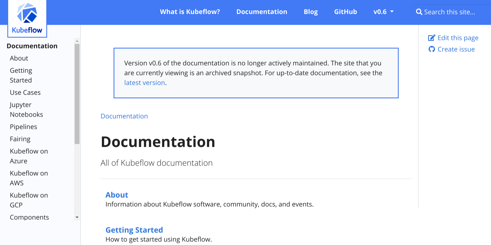

+++
title = "文档版本控制"
weight = 4
date = 2023-05-18T17:03:08+08:00
description = ""
isCJKLanguage = true
draft = false
+++

# Doc Versioning - 文档版本控制

[https://www.docsy.dev/docs/adding-content/versioning/](https://www.docsy.dev/docs/adding-content/versioning/)

​	定制多个文档版本的导航和横幅。

​	根据您的项目的发布和版本控制，您可能希望让用户访问您的文档的先前版本。如何部署先前的版本取决于您。本页面介绍了 Docsy 中可用的功能，可用于在不同版本的文档之间提供导航，并在归档站点上显示信息横幅。

## 添加版本下拉菜单 

​	如果在 `hugo.toml`/`hugo.yaml`/`hugo.json` 中添加一些 `[params.versions]`，Docsy 主题将在顶级菜单中添加版本选择器下拉菜单。您可以指定每个版本的 URL 和名称，如下面的示例所示：

Configuration file:

=== "hugo.yaml"

    ```yaml
    params:
      versions:
        - version: master
          url: 'https://master.kubeflow.org'
        - version: v0.2
          url: 'https://v0-2.kubeflow.org'
        - version: v0.3
          url: 'https://v0-3.kubeflow.org'
    ```

=== "hugo.toml"

    ```toml
    # Add your release versions here
    [[params.versions]]
      version = "master"
      url = "https://master.kubeflow.org"
    
    [[params.versions]]
      version = "v0.2"
      url = "https://v0-2.kubeflow.org"
    
    [[params.versions]]
      version = "v0.3"
      url = "https://v0-3.kubeflow.org"
    ```

=== "hugo.json"

    ```json
    {
      "params": {
        "versions": [
          {
            "version": "master",
            "url": "https://master.kubeflow.org"
          },
          {
            "version": "v0.2",
            "url": "https://v0-2.kubeflow.org"
          },
          {
            "version": "v0.3",
            "url": "https://v0-3.kubeflow.org"
          }
        ]
      }
    }
    ```


​	记得添加当前版本，以便用户可以导航回去！

​	版本下拉菜单的默认标题为 **Releases**。要更改标题，请更改 `hugo.toml`/`hugo.yaml`/`hugo.json` 中的 `version_menu` 参数：

Configuration file:

=== "hugo.yaml"

    ```yaml
    version_menu: 'Releases'
    
    ```

=== "hugo.toml"

    ```toml
    version_menu = "Releases"
    
    ```

=== "hugo.json"

    ```json
    {
      "version_menu": "Releases"
    }
    
    ```


​	如果将 `version_menu_pagelinks` 参数设置为 `true`，则版本下拉菜单中的链接指向其他版本中的当前页面，而不是主页面。如果文档在不同版本之间几乎没有变化，则此功能可能很有用。请注意，如果其他版本中不存在当前页面，则链接将被broken。

​	您可以在[导航和搜索](https://www.docsy.dev/docs/adding-content/navigation/)指南中阅读有关 Docsy 菜单的更多信息。

## 在归档的文档站点上显示横幅 

​	如果为文档的早期版本创建了归档快照，则可以在归档的文档的每个页面顶部添加注释，以让读者知道他们正在查看未维护的快照，并向他们提供最新版本的链接。

​	例如，请参见 [Kubeflow v0.6](https://v0-6.kubeflow.org/docs/) 的归档文档：



图1：Kubeflow v0.6归档文档上的横幅

​	要在文档站点上添加横幅，请在`hugo.toml`/`hugo.yaml`/`hugo.json`文件中进行以下更改：

1. 将`archived_version`参数设置为`true`：

   Configuration file:

=== "hugo.yaml"

	```yaml
       archived_version: true
       
	```

=== "hugo.toml"

	```toml
       archived_version = true
       
	```

=== "hugo.json"

	```json
       {
         "archived_version": true
       }
	```

   

2. 将`version`参数设置为归档文档集的版本。例如，如果归档文档是版本0.1：

   Configuration file:

=== "hugo.yaml"

	```yaml
       version: '0.1'
	```

=== "hugo.toml"

	```toml
       version = "0.1"
	```

=== "hugo.json"

	```json
       {
         "version": "0.1"
       }
	```

   

3. 确保`url_latest_version`包含您想要指向读者的站点的URL。在大多数情况下，这应该是您文档的最新版本的URL：

   Configuration file:

=== "hugo.yaml"

	```yaml
       url_latest_version: 'https://your-latest-doc-site.com'
	```

=== "hugo.toml"

	```toml
       url_latest_version = "https://your-latest-doc-site.com"
	```

=== "hugo.json"

	```json
       {
         "url_latest_version": "https://your-latest-doc-site.com"
       }
	```

   

   
