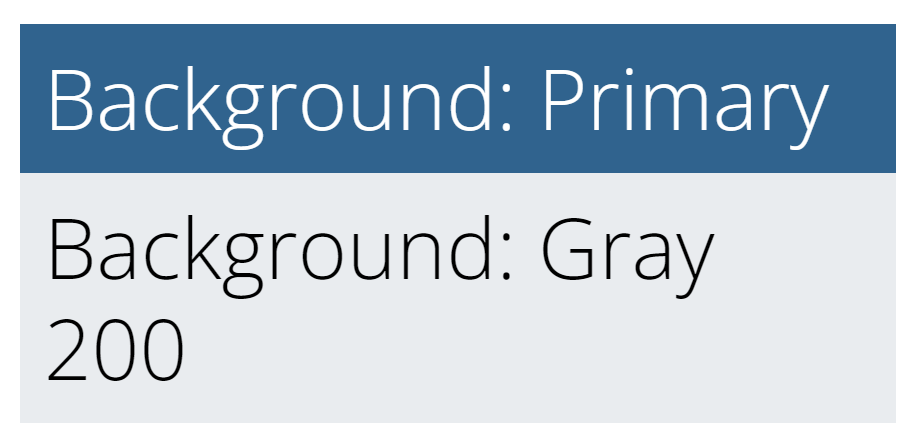
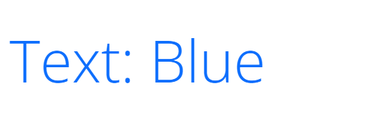

+++
title = "外观与感受"
weight = 2
date = 2023-05-18T17:03:08+08:00
description = ""
isCJKLanguage = true
draft = false
+++

# Look and Feel - 外观与感受 

[https://www.docsy.dev/docs/adding-content/lookandfeel/](https://www.docsy.dev/docs/adding-content/lookandfeel/)

​	自定义您的站点颜色、字体、代码高亮等等。 

​	默认情况下，使用 Docsy 的站点具有主题的默认字体、颜色和一般外观和感受。然而，如果您想要自己的颜色方案（您可能会想要！），您可以使用自己项目特定的值非常容易地覆盖主题默认值——Hugo 在查找构建您的站点的信息时将首先查找您的项目文件。并且，由于 Docsy 使用 Bootstrap 4 和 SCSS 进行样式化，您可以在其特殊的 SCSS 项目变量文件中仅覆盖单个值（如项目颜色和字体），或通过创建自己的样式进行更进一步的定制。

​	Docsy 还提供了使用 Chroma 或 Prism 进行高亮显示代码块的选项。

## 项目样式文件 

​	要自定义项目的外观和感受，请创建以下任一 Docsy 占位符文件的您自己的版本（注意下划线后缀 `_project.scss`）：

- `assets/scss/_variables_project.scss` 是您添加项目特定的主题变量定义（如[站点颜色](https://www.docsy.dev/docs/adding-content/lookandfeel/#site-colors)）以及您想要设置的任何其他 Bootstrap 变量值的地方。您可以在 `assets/scss/_variables.scss` 中找到 Docsy 主题变量及其默认值的列表。有关其他 Bootstrap 4 变量的信息，请参见[变量默认值](https://getbootstrap.com/docs/4.1/getting-started/theming/#variable-defaults)和 Bootstrap 的 [v4-dev/scss/_variables.scss](https://github.com/twbs/bootstrap/blob/v4-dev/scss/_variables.scss) 文件。 
- `assets/scss/_styles_project.scss` 是您可以添加自己的自定义 SCSS 样式的地方，包括覆盖 Docsy 主题 SCSS 文件中的任何样式。 

> 提示 
>
> ​	在服务器模式下运行时未启用 PostCSS（CSS 浏览器前缀自动添加）（速度较慢），因此 Chrome 是推荐的开发选择。
>

## 站点颜色 

​	要自定义您的站点颜色，请在 `assets/scss/_variables_project.scss` 中添加 SCSS 变量覆盖。例如，您可以设置主色和次要色：

```scss
$primary: #390040;
$secondary: #A23B72;
```

​	该主题默认启用渐变背景 (`$enable-gradients`) 和阴影 (`$enable-shadows`) 等功能。您也可以在项目变量文件中通过将变量设置为 `false` 来切换这些功能。

## 字体 

​	该主题使用[Open Sans](https://fonts.google.com/specimen/Open+Sans) 作为其主要字体。要禁用 Google Fonts 并使用系统字体，请在 `assets/scss/_variables_project.scss` 中设置此 SCSS 变量：

```scss
$td-enable-google-fonts: false;
```

​	要配置其他 Google 字体：

```scss
$google_font_name: "Open Sans";
$google_font_family: "Open+Sans:300,300i,400,400i,700,700i";
```

​	请注意，如果您决定选择具有不同权重的字体（在内置配置中，这是 `300`（轻），`400`（中）和 `700`（粗）），您还需要调整与权重相关的变量，即以 `$font-weight-` 开头的变量。

## CSS 实用程序 

​	有关可用 CSS 实用程序类的文档，请参见 [Bootstrap 文档](https://getbootstrap.com/)。这个主题在这个领域自己添加的很少。但是，我们添加了一些颜色状态的 CSS 类，这些类在动态上下文中可能会很有用：

- `.-bg-<color>`
- `.-text-<color>`

​	例如，当您不知道`primary`色是暗色还是亮色时，您可以使用这些类将文本样式为适当的颜色，以确保正确的颜色对比度。当您收到颜色代码作为[短代码](https://www.docsy.dev/docs/adding-content/shortcodes/)参数时，它们也很有用。

​	`<color>` 的值可以是任何颜色名称，例如 `primary`、`white`、`dark`、`warning`、`light`、`success`、`300`、`blue`、`orange` 等。

​	当您使用 `.-bg-<color>` 时，文本颜色将调整以获得适当的对比度：

```html
<div class="-bg-primary p-3 display-4">Background: Primary</div>
<div class="-bg-200 p-3 display-4">Background: Gray 200</div>
```



`.-text-<color>` 仅设置文本颜色：

```html
<div class="-text-blue pt-3 display-4">Text: Blue</div>
```



## 使用Chroma进行代码高亮 

​	从Hugo版本0.60开始，您可以使用[Chroma](https://github.com/alecthomas/chroma)选择一系列代码块高亮和颜色样式，并将其默认应用于您的围栏代码块。如果您复制了最近的`config.toml`，则您的站点将使用Tango（像这个站点一样），否则Hugo默认为Monokai。您可以使用您的`hugo.toml`/`hugo.yaml`/`hugo.json`切换到任何[可用的Chroma样式](https://xyproto.github.io/splash/docs/all.html)（包括我们的Docsy默认Tango）。

Configuration file:

=== "hugo.yaml"

    ```yaml
    markup:
      goldmark:
        renderer:
          unsafe: true
      highlight:
        style: tango
    ```

=== "hugo.toml"

    ```toml
    [markup]
      [markup.goldmark]
        [markup.goldmark.renderer]
          unsafe = true
      [markup.highlight]
          # See a complete list of available styles at https://xyproto.github.io/splash/docs/all.html
          style = "tango"
    ```

=== "hugo.json"

    ```json
    {
      "markup": {
        "goldmark": {
          "renderer": {
            "unsafe": true
          }
        },
        "highlight": {
          "style": "tango"
        }
      }
    }
    ```


​	默认情况下，未指定语言的代码块不会应用代码高亮样式，而是会获得Docsy的默认灰色背景黑色文本的样式。如果您希望代码高亮样式适用于所有代码块，即使没有语言，请在您的`hugo.toml`/`hugo.yaml`/`hugo.json`中的`[markup.highlight]`下取消注释或添加以下行。

Configuration file:

=== "hugo.yaml"

    ```yaml
    guessSyntax: true
    ```

=== "hugo.toml"

    ```toml
    # Uncomment if you want your chosen highlight style used for code blocks without a specified language
    guessSyntax = true
    ```

=== "hugo.json"

    ```json
    {
      "guessSyntax": true
    }
    ```


​	您可以在[语法高亮](https://gohugo.io/content-management/syntax-highlighting/)中了解有关在Hugo中使用Chroma进行代码高亮的更多信息。

## 使用Prism进行代码高亮 

​	您还可以在您的`hugo.toml`/`hugo.yaml`/`hugo.json`中启用Prism语法高亮：

Configuration file:

=== "hugo.yaml"

    ```yaml
    prism_syntax_highlighting: true
    ```

=== "hugo.toml"

    ```toml
    # Enable syntax highlighting and copy buttons on code blocks with Prism
    prism_syntax_highlighting = true
    ```

=== "hugo.json"

    ```json
    {
      "prism_syntax_highlighting": true
    }
    ```


​	启用此选项后，您的站点将使用[Prism](https://prismjs.com/index.html)而不是Chroma进行代码块高亮。

​	Prism是一种流行的开源语法高亮器，支持200多种[语言](https://prismjs.com/index.html#supported-languages)和各种[插件](https://prismjs.com/index.html#plugins)。

​	Docsy包含了用于基本Prism配置的JavaScript和CSS文件，支持：

- 使用Prism`Default`主题样式化的代码块 
- 代码块上的复制到剪贴板按钮 
- 为许多常见语言指定的语法高亮，如下面的Prism下载链接中所指定的，[定制您的下载](https://prismjs.com/download.html#themes=prism&languages=markup+css+clike+javascript+bash+c+csharp+cpp+go+java+markdown+python+scss+sql+toml+yaml&plugins=toolbar+copy-to-clipboard)。 

### 没有语言的代码块 

​	默认情况下，Prism代码高亮样式不会应用于没有指定语言的代码块，而是获得Docsy的默认灰色背景黑色文本的样式。要将Prism样式应用于没有语言或不受Prism支持的语言的代码块，请在三个反引号后指定`none`作为语言。

### 扩展Prism以支持其他语言或插件 

​	如果包含的Prism配置不能满足您的要求，并且您想使用其他语言或插件，您可以使用您自己的文件替换包含的文件。

1. 从[https://prismjs.com/download.html](https://prismjs.com/download.html)下载您自己的Prism JS和CSS文件 
2. 用您下载的文件替换包含的Prism JS和CSS文件： 
   - 将JavaScript文件复制到`static/js/prism.js` 
   - 将CSS文件复制到`static/css/prism.css` 

## 导航栏 

​	对于包含[blocks/cover](https://www.docsy.dev/docs/adding-content/shortcodes/#blockscover) shortcode的页面（如大多数主页），只要主题图片没有向上滚动到导航栏上方，导航栏就是半透明的。例如，请参阅[About Docsy](https://www.docsy.dev/about/)页面。这种最初的半透明设置确保主题图片最大程度地可见。

​	在主题图片滚过导航栏之后，导航栏（不透明）的背景色被设置为站点的[主色调](https://www.docsy.dev/docs/adding-content/lookandfeel/#site-colors)。

​	有些主题图片的导航栏条目的文本可能难以阅读。在这些情况下，您可以通过在站点配置文件中将`params.ui.navbar_translucent_over_cover_disable`选项设置为`true`来禁用导航栏的半透明效果。

### 美化您的项目标识和名称 

​	默认的Docsy导航栏（`.td-navbar`）显示您的站点标识，包括以下内容：

1. [您的logo](https://www.docsy.dev/docs/adding-content/iconsimages/#add-your-logo)，作为内联SVG包含在导航栏中，并由`.td-navbar .navbar-brand svg`样式化。有关样式详细信息，请参见[_nav.scss](https://github.com/google/docsy/blob/main/assets/scss/_nav.scss)。

   为确保您的logo 正确显示，您可能需要调整其大小并确保它没有高度和宽度属性，以便其大小完全响应。根据需要[覆盖](https://www.docsy.dev/docs/adding-content/lookandfeel/#project-style-files)`.td-navbar .navbar-brand svg`或（等效地）`.td-navbar .navbar-brand__logo`的默认样式。

2. 您的项目名称，即站点`title`。如果您不希望您的项目名称出现（例如，因为您的标志是或包含[字体商标](https://en.wikipedia.org/wiki/Wordmark)），则可以将以下自定义样式添加到您[项目的样式](https://www.docsy.dev/docs/adding-content/lookandfeel/#project-style-files)中：

   ```css
   .td-navbar .navbar-brand__name {
     display: none;
   }
   ```


## 表格 

​	Docsy通过类`.td-table`对所有表格应用以下样式：

- [Bootstrap表格](https://getbootstrap.com/docs/5.3/content/tables/)样式： 
  - `.table`
  - `.table-striped`
  - `.table-responsive`
  
- `display: block`，这对于表格响应性很重要。 


​	这种样式配置让您仅使用Markdown即可获得响应式表格，而无需将表格包装在`<div>`中。然而，这意味着所有表格的`display`设置为`block`。如果您不希望这样，请为表格创建自己的自定义样式。

> 注意
>
> ​	我们的表格样式违反了[Bootstrap建议将表格](https://getbootstrap.com/docs/5.3/content/tables/#responsive-tables)包装在`.table-responsive`中 —— 然而，我们认为让用户仅使用Markdown表格语法创建响应式表格更方便。 
>

​	要在没有 Docsy 样式的情况下呈现表格，请将 `.td-initial` 类应用于表格。从生成的 `<table>` 样式基础上，更容易应用自定义样式（而不是试图撤消 Docsy 表格样式），如以下示例所示：

```markdown
| 形状      | 边数            |
| -------- | --------------- |
| Triangle | 3               |
| Square   | 4               |
{.td-initial .my-dark-table-style}
```

​	上面的示例使用了 [Markdown 属性](https://discourse.gohugo.io/t/markdown-attributes/41783)语法，并可能渲染为如下：

| 形状     | 边数 |
| -------- | ---- |
| Triangle | 3    |
| Square   | 4    |

## 自定义模板 

### 将代码添加到 head 或 before body end 

​	如果您需要在每个页面的 `head` 部分添加一些代码（CSS 导入、cookie 同意或类似），请将 `head-end.html` 局部添加到您的项目中：

```
layouts/partials/hooks/head-end.html
```

​	并在该文件中添加您需要的代码。您的局部代码会自动包含在主题局部`head.html` 结束前。本主题版本的 `head-end.html` 为空。

​	类似地，如果您想在 `body` end 前添加一些代码，请创建以下文件的自己的版本：

```
layouts/partials/hooks/body-end.html
```

​	此文件中的任何代码都会自动包含在本主题局部 `scripts.html` 的结尾。

​	`head.html` 和 `scripts.html` 都用于构建 Docsy 的[基本页面布局](https://github.com/google/docsy/blob/main/layouts/_default/baseof.html)，该布局被所有其他页面模板所使用：

```html
<!doctype html>
<html lang="{{ .Site.Language.Lang }}" class="no-js">
  <head>
    {{ partial "head.html" . }}
  </head>
  <body class="td-{{ .Kind }}">
    <header>
      {{ partial "navbar.html" . }}
    </header>
    <div class="container-fluid td-default td-outer">
      <main role="main" class="td-main">
        {{ block "main" . }}{{ end }}
      </main>
      {{ partial "footer.html" . }}
    </div>
    {{ partialCached "scripts.html" . }}
  </body>
</html>
```
