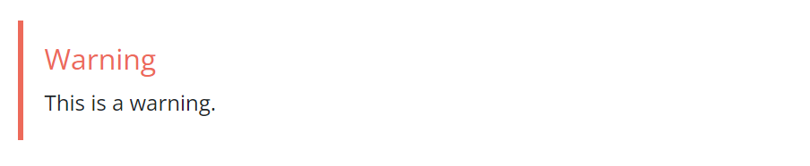

+++
title = "Docsy简码"
weight = 5
date = 2023-05-18T17:03:08+08:00
description = ""
isCJKLanguage = true
draft = false
+++

# Docsy Shortcodes - Docsy简码 

https://www.docsy.dev/docs/adding-content/shortcodes/

​	使用Docsy的Hugo简码快速构建站点页面。 

​	Hugo 允许你定义并使用 [简码](https://gohugo.io/content-management/shortcodes/)，而不是从头编写所有站点页面。这些可重复使用的内容片段可以包含在你的页面中，通常使用 HTML 创建难以或不可能在简单的 Markdown 中实现的效果。简码还可以具有参数，例如，让你向花哨的简码文本框中添加自己的文本。除了 Hugo 的[内置简码](https://gohugo.io/content-management/shortcodes/)外，Docsy 还提供了一些自己的 简码，以帮助你构建页面。

## 简码分隔符 

​	如下所示，使用花括号样式的[简码分隔符](https://gohugo.io/content-management/shortcodes/#use-shortcodes)`\{\{\<...\>\}\}`告诉Hugo内部内容是HTML/纯文本，无需进一步处理。通过使用分隔符`\{\{\%...\%\}\}`，Hugo将把简码body视为Markdown。您可以在页面中使用这两种样式。

## 简码块 

​	本主题附带一组自定义页面块（**Page Block** ）简码，可用于组合着陆页面、About页面等。

​	这些块共享一些通用参数：

- height

  块容器的预定义高度。可以是 `min`、`med`、`max`、`full` 或 `auto` 中的一个。将其设置为 `full` 将填充视口高度，这对于着陆页非常有用。

- color

  如果未提供，块将被分配一个主题调色板的颜色，但如果需要，您可以设置自己的颜色。您可以使用所有 Bootstrap 的颜色名称、主题颜色名称或灰度阴影。一些例子包括 `primary`、`white`、`dark`、`warning`、`light`、`success`、`300`、`blue`、`orange`。这将成为块的**背景颜色**，但文本颜色将适应以获得适当的对比度。

### blocks/cover

​	**blocks/cover**简码创建填充页面顶部的着陆页类型块。

```html
\{\{\< blocks/cover title="Welcome!" image_anchor="center" height="full" color="primary" \>\}\}
<div class="mx-auto">
	<a class="btn btn-lg btn-primary me-3 mb-4" href="\{\{\< relref "/docs" \>\}\}">
		Learn More <i class="fa-solid fa-circle-right ms-2"></i>
	</a>
	<a class="btn btn-lg btn-secondary me-3 mb-4" href="https://example.org">
		Download <i class="fa-brands fa-github ms-2 "></i>
	</a>
	<p class="lead mt-5">This program is now available in <a href="#">AppStore!</a></p>
	<div class="mx-auto mt-5">
		\{\{\< blocks/link-down color="info" \>\}\}
	</div>
</div>
\{\{\< /blocks/cover \>\}\}
```

请注意，上面提到的相关简码参数将具有合理的默认值，但为了完整性而包含在此处。

| Parameter    | Default                                                 | Description                                                 |
| ------------ | ------------------------------------------------------- | ----------------------------------------------------------- |
| title        |                                                         | The main display title for the block.  该块的主要显示标题。 |
| image_anchor |                                                         |                                                             |
| height       |                                                         | See above.                                                  |
| color        |                                                         | See above.                                                  |
| byline       | Byline text on featured image. 在特色图片上的署名文本。 |                                                             |

​	要设置背景图像，请在该页面的[Page Bundle](https://www.docsy.dev/docs/adding-content/content/#page-bundles)中放置一个带有"background"单词的图像名称。例如，在我们的示例站点中，首页的封面块中的背景图像为`featured-background.jpg`，在同一目录中。

> 提示
>
> 如果在图像名称中还包括featured单词，例如`my-featured-background.jpg`，则在共享时它也将用作Twitter Card图像。 
>

​	有关可用图标，请参见[Font Awesome](https://fontawesome.com/icons?d=gallery&m=free)。

### blocks/lead

​	**blocks/lead**简码是一个简单的引导/标题块，具有居中的文本和向下箭头指向下一节。

```go-html-template
\{\{\% blocks/lead color="dark" \%\}\}
TechOS is the OS of the future.

Runs on **bare metal** in the **cloud**!
\{\{\% /blocks/lead \%\}\}
```

| Parameter | Default  | Description                                                  |
| --------- | -------- | ------------------------------------------------------------ |
| height    | `auto`   | See [Shortcode blocks](https://www.docsy.dev/docs/adding-content/shortcodes/#shortcode-blocks) |
| color     | .Ordinal | See [Shortcode blocks](https://www.docsy.dev/docs/adding-content/shortcodes/#shortcode-blocks) |

### blocks/section

​	**blocks/section**简码旨在作为通用内容容器使用。它有两种"口味（flavors）"，一种适用于一般内容，另一种则具有更适合包装水平特征章节的样式。

​	下面的示例显示一个包含3个特征章节的章节。

```go-html-template
\{\{\< blocks/section color="dark" type="row" \>\}\}
\{\{\% blocks/feature icon="fa-lightbulb" title="Fastest OS **on the planet**!" \%\}\}
The new **TechOS** operating system is an open source project. It is a new project, but with grand ambitions.
Please follow this space for updates!
\{\{\% /blocks/feature \%\}\}
\{\{\% blocks/feature icon="fa-brands fa-github" title="Contributions welcome!" url="https://github.com/gohugoio/hugo" \%\}\}
We do a [Pull Request](https://github.com/gohugoio/hugo/pulls) contributions workflow on **GitHub**. New users are always welcome!
\{\{\% /blocks/feature \%\}\}
\{\{\% blocks/feature icon="fa-brands fa-twitter" title="Follow us on Twitter!" url="https://twitter.com/GoHugoIO" \%\}\}
For announcement of latest features etc.
\{\{\% /blocks/feature \%\}\}
\{\{\< /blocks/section \>\}\}
```

| 参数     | 默认值 | 描述                                                         |
| -------- | ------ | ------------------------------------------------------------ |
| `height` |        | See above.                                                   |
| `color`  |        | See above.                                                   |
| `type`   |        | 如果您想要一个一般的容器，请指定"container"（默认值），或者如果该章节包含列 - 必须是直接子级，则指定"row"。 |

### blocks/feature

```go-html-template
\{\{\% blocks/feature icon="fa-brands fa-github" title="Contributions welcome!" url="https://github.com/gohugoio/hugo" \%\}\}
We do a [Pull Request](https://github.com/gohugoio/hugo/pulls) contributions workflow on **GitHub**. New users are always welcome!
\{\{\% /blocks/feature \%\}\}
```

| 参数  | 默认值 | 描述                   |
| ----- | ------ | ---------------------- |
| title |        | The title to use.      |
| url   |        | The URL to link to.    |
| icon  |        | The icon class to use. |

### blocks/link-down

​	**blocks/link-down**简码创建导航链接到下一个章节。它旨在与其他块简码结合使用。

```go-html-template
<div class="mx-auto mt-5">
	\{\{\< blocks/link-down color="info" \>\}\}
</div>
```

| 参数  | 默认值 | 描述       |
| ----- | ------ | ---------- |
| color | info   | See above. |

## 简码助手（helpers） 

### alert

​	**alert**简码创建一个警报块，可用于显示通知或警告。

```go-html-template
\{\{\% alert title="Warning" color="warning" \%\}\}
This is a warning.
\{\{\% /alert \%\}\}
```

渲染为：



| 参数 | 默认值 | 描述                                                  |
| --------- | ------- | ------------------------------------------------------------ |
| color     | primary | 其中之一的主题颜色，例如`primary`，`info`，`warning`等。 |

### pageinfo

​	**pageinfo** 简码创建了一个文本框，您可以使用它来为页面添加横幅信息，例如告诉用户页面包含占位内容，内容已过时或记录了一个 beta 功能。

```go-html-template
\{\{\% pageinfo color="primary" \%\}\}
This is placeholder content.
\{\{\% /pageinfo \%\}\}
```

渲染成：


| 参数 | 默认值 | 描述                                                  |
| --------- | ------- | ------------------------------------------------------------ |
| color     | primary | 其中之一的主题颜色，例如`primary`，`info`，`warning`等。 |

### imgproc

​	**imgproc**简码会在当前[Page Bundle](https://www.docsy.dev/docs/adding-content/content/#page-bundles)中查找图片，并根据给定的一组处理指令对其进行缩放。

```go-html-template
\{\{\< imgproc spruce Fill "400x450" \>\}\}
Norway Spruce <i>Picea abies</i> shoot with foliage buds.
\{\{\< /imgproc \>\}\}
```


​	上面的示例还添加了带有照片归属地的副标题。当使用来自[WikiMedia](https://commons.wikimedia.org/)等免费许可的插图时，大多数情况下需要一种方法来归属作者或许可证持有人。您可以在你的页面前置元数据中的页面资源中添加元数据。在此主题中，`byline` 参数通常用于此目的：

Front matter:

=== "yaml"

    ```yaml
    ---
    resources:
    - src: "**spruce*.jpg"
      params:
        byline: "Photo: Bjørn Erik Pedersen / CC-BY-SA"
    ---
    ```

=== "toml"

    ```toml
    +++
    [[resources]]
    src = "**spruce*.jpg"
    
      [resources.params]
      byline = "Photo: Bjørn Erik Pedersen / CC-BY-SA"
    +++
    ```

=== "json"

    ```json
    {
      "resources": [
        {
          "src": "**spruce*.jpg",
          "params": {
            "byline": "Photo: Bjørn Erik Pedersen / CC-BY-SA"
          }
        }
      ]
    }
    ```


| 参数 | 描述                                                         |
| ---: | ------------------------------------------------------------ |
|    1 | 图片文件名或足够的文件名以便识别它（我们使用Glob匹配）       |
|    2 | 命令。可以是`Fit`、`Resize`、`Fill`或`Crop`中的一个。参见[Image Processing Methods](https://gohugo.io/content-management/image-processing/#image-processing-methods)。 |
|    3 | 处理选项，例如 `400x450 r180`。参见[Image Processing Options](https://gohugo.io/content-management/image-processing/#image-processing-options)。 |

### swaggerui

​	`swaggerui` 简码可以放置在任何使用 [`swagger` 布局](https://github.com/google/docsy/tree/main/layouts/swagger) 的页面中；它使用任何 OpenAPI YAML 或 JSON 文件作为源来渲染 [Swagger UI](https://swagger.io/tools/swagger-ui/)。该文件可以托管在任何位置，例如您站点的根 [`/static` 文件夹](https://www.docsy.dev/docs/adding-content/content/#adding-static-content)中。

Front matter:

=== "yaml"

    ```yaml
    ---
    title: "Pet Store API"
    type: swagger
    weight: 1
    description: Reference for the Pet Store API
    ---
    
    \{\{\< swaggerui src="/openapi/petstore.yaml" \>\}\}
    ```

=== "toml"

    ```toml
    +++
    title = "Pet Store API"
    type = "swagger"
    weight = 1
    description = "Reference for the Pet Store API"
    +++
    
    \{\{\< swaggerui src="/openapi/petstore.yaml" \>\}\}
    ```

=== "json"

    ```json
    {
      "title": "Pet Store API",
      "type": "swagger",
      "weight": 1,
      "description": "Reference for the Pet Store API"
    }
    
    \{\{\< swaggerui src="/openapi/petstore.yaml" \>\}\}
    ```


​	您可以通过覆盖Swagger的CSS或通过编辑和编译[Swagger UI dist](https://github.com/swagger-api/swagger-ui)自己来自定义Swagger UI的外观和感觉，并替换`themes/docsy/static/css/swagger-ui.css`。

### redoc

​	`redoc`简码使用开源[Redoc](https://github.com/Redocly/redoc)工具从OpenAPI YAML或JSON文件中渲染参考API文档。该文件可以托管在您喜欢的任何位置，例如在站点的根[`/static` 文件夹](https://www.docsy.dev/docs/adding-content/content/#adding-static-content)中，但您也可以使用一个URL，例如：

```yaml
---
title: "Pet Store API"
type: docs
weight: 1
description: Reference for the Pet Store API
---

\{\{\< redoc "https://raw.githubusercontent.com/OAI/OpenAPI-Specification/main/examples/v2.0/yaml/petstore.yaml" \>\}\}
```

### iframe

​	使用此简码，您可以将外部内容作为内联框架（`iframe`）嵌入Docsy页面，参见：[https://www.w3schools.com/tags/tag_iframe.asp](https://www.w3schools.com/tags/tag_iframe.asp)

| 参数            | 默认值                                                       | 描述                                                         |
| --------------- | ------------------------------------------------------------ | ------------------------------------------------------------ |
| src             |                                                              | 外部内容的URL                                                |
| width           | 100%                                                         | iframe的宽度                                                 |
| `tryautoheight` | true                                                         | 如果为 `true`，则该简码将尝试使用 JavaScript 计算嵌入式内容所需的高度，如此处所述：[https://stackoverflow.com/a/14618068](https://stackoverflow.com/a/14618068)。这仅在嵌入式内容与当前域名相同时才可能实现（[https://stackoverflow.com/questions/22086722/resize-cross-domain-iframe-height](https://stackoverflow.com/questions/22086722/resize-cross-domain-iframe-height)）。请注意，即使嵌入式内容与当前域名相同，仍取决于内容的结构是否能够正确计算高度。 |
| style           | min-height:98vh; border:none;                                | 用于 iframe 的 CSS 样式。`min-height: 98vh;` 是在 `tryautoheight` 不起作用时的备选项。`border: none;` 将 iframe 的边框删除 - 如果您希望嵌入式内容看起来更像页面中的内部内容，则这很有用。 |
| sandbox         | false                                                        | 您可以通过设置 `sandbox = true` 完全打开沙盒模式，或使用在 [HTML 标准](https://www.w3schools.com/tags/att_iframe_sandbox.asp) 中定义的 iframe 参数 `sandbox` 的常见值来允许特定功能。 |
| name            | iframe-name                                                  | 指定该[iframe的名称](https://www.w3schools.com/tags/att_iframe_name.asp)。 |
| id              | iframe-id                                                    | 设置该iframe的ID。                                           |
| class           |                                                              | 设置该iframe的类的可选参数。                                 |
| sub             | 您的浏览器无法显示嵌入框架。您可以通过以下链接访问嵌入页面： | 如果用户的浏览器无法显示嵌入式框架，则显示的文本（除了嵌入的 URL）。 |

> 警告
>
> ​	只有在服务器的 `X-Frame-Options` 未设置或明确允许被嵌入到您的站点时，才能嵌入外部内容。有关详细信息，请参见[https://developer.mozilla.org/zh-CN/docs/Web/HTTP/Headers/X-Frame-Options](https://developer.mozilla.org/zh-CN/docs/Web/HTTP/Headers/X-Frame-Options)。
>


​	有几种工具可用于检查站点是否可以通过iframe嵌入，例如：[https://gf.dev/x-frame-options-test](https://gf.dev/x-frame-options-test)。请注意，当此测试显示"Couldn’t find the X-Frame-Options header in the response headers."时，您**可以**嵌入它，但是当测试显示"Great! X-Frame-Options header was found in the HTTP response headers as highlighted below."时，除非已明确启用了您的站点，否则您**不可以**嵌入它。

## Tabbed panes 选项卡式窗格 

​	在编写内容时，有时非常有用的是选项卡式窗格。一个常见的用例是显示多个语法突出显示的代码块，这些代码块展示了同一问题在不同编程语言中的解决方法。例如，下面的选项卡式窗格显示了通常在学习新编程语言时编写的`Hello world`！程序的语言特定变体：

=== "C"

    ```C
    #include <stdio.h>
    #include <stdlib.h>
    
    int main(void)
    {
      puts("Hello World!");
      return EXIT_SUCCESS;
    }
    ```

=== "C++"

    ```C++
    #include <iostream>
    
    int main()
    {
      std::cout << "Hello World!" << std::endl;
    }
    ```


=== "Go"

    ```Go
    package main
    import "fmt"
    func main() {
      fmt.Printf("Hello World!\n")
    }
    ```

=== "Java"

    ```Java
    class HelloWorld {
      static public void main( String args[] ) {
        System.out.println( "Hello World!" );
      }
    }
    ```

=== "Kotlin"

    ```Kotlin
    fun main(args : Array<String>) {
        println("Hello, world!")
    }
    ```

=== "Lua"

    ```Lua
    print "Hello world"
    
    ```

=== "PHP"

    ```PHP
    <?php
    echo 'Hello World!';
    ?>
    
    ```

=== "Python"

    ```Python
    print("Hello World!")
    
    ```

=== "Ruby"

    ```Ruby
    puts "Hello World!"
    
    ```

=== "Scala"

    ```Scala
    object HelloWorld extends App {
      println("Hello world!")
    }
    
    ```

=== "Reference"

    ```c
    
    ```


​	Docsy模板提供了两个简码`tabpane`和`tab`，让您轻松创建选项卡式窗格。要了解如何使用它们，请查看以下代码块，该代码块渲染为右对齐的窗格，其中一个选项卡被禁用，另外三个选项卡处于活动状态：

```go-html-template
\{\{\< tabpane text=true right=true \>\}\}
  \{\{\% tab header="**Languages**:" disabled=true /\%\}\}
  \{\{\% tab header="English" lang="en" \%\}\}
  
  Welcome!
  \{\{\% /tab \%\}\}
  \{\{\< tab header="German" lang="de" \>\}\}
    <b>Herzlich willkommen!</b>
    
  \{\{\< /tab \>\}\}
  \{\{\% tab header="Swahili" lang="sw" \%\}\}
  
  **Karibu sana!**
  \{\{\% /tab \%\}\}
\{\{\< /tabpane \>\}\}
```

​	这段代码转换为下面的右对齐选项卡窗格，显示英语、德语或斯瓦希里语的`Welcome!`问候：

**Languages**:

=== "English"
	

=== "German"
	

=== "Swahili"
	

### 简码详细信息 

​	选项卡式窗格使用两个简码实现：

- `tabpane` 简码是选项卡的容器元素。该简码可以包含可选的命名参数 `lang`、`highlight` 和 `right`。可选参数 `lang` 和 `highlight` 的值会作为 Hugo 内置函数 [highlight](https://gohugo.io/functions/highlight/) 的第二个 `LANG` 和第三个 `OPTIONS` 参数传递，该函数用于渲染各个选项卡中的代码块。如果您想要右对齐选项卡，请指定 `right=true`。如果选项卡的标题文本等于选项卡代码块中使用的语言（如上面的第一个选项卡窗格示例），您可以在周围的 `tabpane` 简码中指定 `langEqualsHeader=true`。然后，各个选项卡的标题文本将自动设置为相应选项卡的 `lang` 参数。

- 各种选项卡简码代表您想要显示的选项卡。对于每个选项卡，通过指定命名参数 `header` 来设置选项卡的标题文本。如果`header`参数是您选项卡简码中唯一的参数，则可以将标题设置为未命名参数，例如 `{ tab "My header" }} … {{ /tab }}`。如果您的选项卡简码没有任何参数，则选项卡的header 将默认为Tab n。要将窗格分为左对齐和右对齐的选项卡组，请在分隔选项卡中指定 `right=true`。通过多次设置 `right=true`，您甚至可以渲染多个选项卡组。通过指定参数 `disabled=true` 可以禁用选项卡。对于启用的选项卡，有两种内容显示模式，代码表示和文本表示：
	
	- 默认情况下，选项卡的内容将渲染为代码块。为了获得适当的语法高亮显示，请为每个选项卡指定命名参数 `lang`，并可选地指定参数 `highlight`。在父选项卡窗格简码中设置的参数将被覆盖。
	- 如果您的选项卡内容应该渲染为具有不同样式和可选图像的文本，请将 `text=true` 作为`tabpane` （或`tab`）的参数。如果您的内容是 Markdown，请使用百分号 `%` 作为选项卡简码的最外层分隔符，您的标记应如下所示：`\{\{\% tab \%\}\}Your **markdown** content\{\{\% /tab \%\}\}`。对于 HTML 内容，请使用方括号 `<>` 作为最外层分隔符：`\{\{\< tab \>\}\}Your <b>HTML</b> content\{\{\< /tab \>\}\}`。
	
	
	

>  信息
>
>  ​	默认情况下，所选tab（选项卡） 的语言将存储并在不同的浏览器会话之间保留。如果选项卡内的内容长度差异很大，则在切换选项卡时可能会导致不必要的滚动。要禁用此不必要的行为，请在`tabpane`简码中指定 `persistLang=false`。

## Card panes 卡片窗格

​	在编写内容时，将类似的文本块或代码片段放在类似卡片的元素上，可以让它们可选地并排呈现，这在某些情况下非常有用。下面是一个样本卡片组，展示了美国的前四位总统，我们来演示一下这个功能：


​	Docsy 支持通过不同的简码创建此类卡片窗格： 

-  `cardpane` 简码是用来包含不同卡片的容器元素。
- `card` 简码代表一个单独的卡片，每个简码代表一个独立的卡片。虽然卡片通常会出现在卡片组内，但一个单独的卡片也可以单独呈现。`card` 简码可以包含文本、图片或任何其他任意类型的 Markdown 或 HTML 标记作为内容。如果你的内容是编程代码，建议使用 `card-code` 简码，这是一种具有代码高亮和其他可选功能（如行号、某些行的高亮等）的特殊卡片。

### 简码`card`（用于文本、图像等）

​	如上所述，卡片可以使用 `card` 或 `card-code` 简码之一进行编码。如果您的内容是除了编程代码以外的任何类型的文本，请使用通用的 `card` 简码。以下代码示例演示如何编码`card` 元素：

```go-html-template
\{\{\< card header="**Imagine**" title="Artist and songwriter: John Lennon" subtitle="Co-writer: Yoko Ono"
          footer=""\>\}\}
Imagine there's no heaven, It's easy if you try<br/>
No hell below us, above us only sky<br/>
Imagine all the people living for today…

…
\{\{\< /card \>\}\}
```

​	此代码转换为下面的左侧的卡片，显示 John Lennon 著名歌曲 `Imagine` 的歌词。右侧的第二个说明性card 元素指示并解释了card 的各个组成部分：


​	虽然卡片的主要内容取自 `card` 简码的内部标记，但可选元素 `footer`、`header`、`title` 和 `subtitle` 都作为简码的命名参数指定。

### 简码`card-code`（用于编程代码） 

​	如果您想在卡片上显示编程代码，可以使用专门的`card-code` 简码。下面的示例演示了如何用C编写著名的`Hello world!`应用程序的卡片元素：

```go-html-template
\{\{\< card-code header="**C**" lang="C" \>\}\}
#include <stdio.h>
#include <stdlib.h>

int main(void)
{
  puts("Hello World!");
  return EXIT_SUCCESS;
}
\{\{\< /card-code \>\}\}
```

​	这段代码将转换为下面的卡片：


​	`card-code` 简码可以可选地包含`lang`和/或`highlight`命名参数。这些可选参数的值作为第二个`LANG`和第三个`OPTIONS`参数传递给Hugo的内置[highlight](https://gohugo.io/functions/highlight/)函数，该函数用于渲染在卡片上呈现的代码块。

### 卡片组 

​	将两个或多个卡片并排显示可以通过将它们放在`cardpane`简码的开放和关闭元素之间轻松实现。卡片组的一般标记与选项卡窗格的标记非常相似：

```go-html-template
\{\{\< cardpane \>\}\}
  \{\{\< card header="Header card 1" \>\}\}
    Content card 1
  \{\{\< /card \>\}\}
  \{\{\< card header="Header card 2" \>\}\}
    Content card 2
  \{\{\< /card \>\}\}
  \{\{\< card header="Header card 3" \>\}\}
    Content card 3
  \{\{\< /card \>\}\}
\{\{\< /cardpane \>\}\}
```

​	与选项卡（tabs）不同，卡片（cards ）是并排呈现的。这尤其有用，如果您想在两个卡片上比较不同的编程技术（传统 vs. 现代），就像上面的示例演示的那样：


## 包含外部文件 

​	有时候有一些内容对多个文档都是相关的，或者是存储在一个不一定是文档的文件中。对于这样的情况，`readfile` 简码允许您将外部文件的内容导入到文档中。

### 重用文档 

​	如果您想在多个文档中重复使用一些内容，可以将该内容编写在一个单独的文件中，然后在需要时包含它。

​	例如，假设您有一个名为`installation.md`的文件，其内容如下：

```go-html-template
## Installation

\{\{\% alert title="Note" color="primary" \%\}\}
Check system compatibility before proceeding.
\{\{\% /alert \%\}\}

1.  Download the installation files.

1.  Run the installation script

    `sudo sh install.sh`

1.  Test that your installation was successfully completed.
```

​	您可以将此部分导入到另一个文档中：

```go-html-template
The following section explains how to install the database:

\{\{\% readfile "installation.md" \%\}\}
```

​	这将渲染出好像指令在父文档中一样。导入文件包含简码时需要 Hugo v0.101.0+ 才能正确被渲染。

------

​	以下部分解释了如何安装数据库：


------

​	该参数是该文件的相对路径。仅支持在父文件的工作目录下的相对路径。

​	对于工作目录之外的文件，可以使用以 `/` 开头的绝对路径。根目录是 `/content` 文件夹。

### 包含代码文件 

​	假设您有一个包含多个代码示例的`includes`文件夹，您希望将其用作文档的一部分。您可以使用`readfile`并带有一些额外的参数：

```go-html-template
To create a new pipeline, follow the next steps:

1.  Create a configuration file `config.yaml`:

    \{\{\< readfile file="includes/config.yaml" code="true" lang="yaml" \>\}\}

2.  Apply the file to your cluster `kubectl apply config.yaml`
```

​	该代码自动读取`includes/config.yaml`的内容并将其插入到文档中。渲染后的文本如下所示：

------


------

> 警告
>
> ​	为了使代码高亮显示正常工作，必须使用`\{\{\< \>\}\}`的分隔符。

​	该"file"参数是文件的相对路径。仅支持在父文件的工作目录下的相对路径。

​	对于工作目录之外的文件，可以使用以 `/` 开头的绝对路径。根目录是 `/content` 文件夹。

| 参数 | 默认值     | 描述                                      |
| ---- | ---------- | ----------------------------------------- |
| file |            | 外部文件路径                              |
| code | false      | 布尔值。如果为`true` ，该内容将被视为代码 |
| lang | plain text | 编程语言                                  |

### 错误报告

​	如果该简码无法找到指定的文件，则该简码会抛出编译错误。

​	在下面的示例中，如果无法找到`includes/deploy.yml`文件，Hugo会抛出编译错误：

```go-html-template
\{\{\< readfile file="includes/deploy.yaml" code="true" lang="yaml" \>\}\}
```

​	或者，Hugo可以在呈现的页面上显示一条消息，而不是抛出编译错误。添加`draft="true"`参数。例如：

```go-html-template
\{\{\< readfile file="includes/deploy.yaml" code="true" lang="yaml" draft="true" \>\}\}
```

## 条件文本

​	`conditional-text` 简码允许您根据配置文件中设置的 `buildCondition` 参数的值来显示或隐藏内容的某些部分。如果您正在从相同的源生成不同的构建，例如使用不同的产品名称，那么这将非常有用。这个简码帮助您处理这些构建之间的小差异。

```text
\{\{\% conditional-text include-if="foo" \%\}\}
This text appears in the output only if `buildCondition = "foo" is set in your config file`.
\{\{\% /conditional-text \%\}\}
\{\{\% conditional-text exclude-if="bar" \%\}\}
This text does not appear in the output if `buildCondition = "bar" is set in your config file`.
\{\{\% /conditional-text \%\}\}
```

​	如果您正在使用此简码，请注意，在求值条件时，子字符串匹配也将被视为匹配。这意味着，如果您设置了 `include-if="foobar"`，而 `buildcondition = "foo"`，则匹配！
