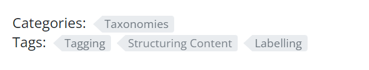

+++
title = "分类支持"
weight = 10
date = 2023-05-18T17:03:08+08:00
description = ""
isCJKLanguage = true
draft = false
+++

# Taxonomy Support - 分类支持 

https://www.docsy.dev/docs/adding-content/taxonomy/

​	使用标签、分类、标签结构等分类法来组织内容。



​	Docsy支持Hugo的分类法（参见：[https://gohugo.io/content-management/taxonomies/](https://gohugo.io/content-management/taxonomies/)）用于文档和博客章节。您可以在此页面上查看默认布局，并测试生成的链接行为。

## Terminology 术语

​	要理解分类法的用法，您应理解以下术语： 

- Taxonomy 分类法 

  可用于对内容进行分类的类别，例如：标签、分类、项目、人员。

- Term 条目

  分类法内的关键词，例如：在项目中：项目A、项目B。

- Value 值

  分配给条目的内容，例如：您站点上的页面，它属于特定的项目 

​	在官方Hugo文档中可以找到一个电影站点的分类法示例：[https://gohugo.io/content-management/taxonomies/#example-taxonomy-movie-website](https://gohugo.io/content-management/taxonomies/#example-taxonomy-movie-website)。

## 参数 

​	有各种参数来控制项目[配置文件](https://gohugo.io/getting-started/configuration/#configuration-file)中分类法的功能。

​	默认情况下，Hugo 中启用`tags`和`categories`的分类法（参见：[https://gohugo.io/content-management/taxonomies/#default-taxonomies](https://gohugo.io/content-management/taxonomies/#default-taxonomies)）。在 Docsy 中，默认情况下在 `hugo.toml`/`hugo.yaml`/`hugo.json` 中禁用分类法：

Configuration file:

=== "hugo.yaml"

    ```yaml
    disableKinds:
      - taxonomy
      - taxonomyTerm
    
    ```

=== "hugo.toml"

    ```toml
    disableKinds = ["taxonomy", "taxonomyTerm"]
    
    ```

=== "hugo.json"

    ```json
    {
      "disableKinds": [
        "taxonomy",
        "taxonomyTerm"
      ]
    }
    
    ```


​	如果你想在Docsy中启用分类法，你需要在你的项目的 `hugo.toml`/`hugo.yaml`/`hugo.json` 文件中删除（或注释掉）这一行。然后Hugo将生成 `tags` 和 `categories` 的分类法页面。如果你想使用其他分类法，你需要在你的[配置文件](https://gohugo.io/getting-started/configuration/#configuration-file)中定义它们。如果你想同时使用自己的分类法和默认的 `tags` 和 `categories` 分类法，你还需要除了你自己的分类法外定义它们。你需要为每个分类法提供复数和单数标签。

​	通过以下示例，你可以定义一个名为 `projects` 的额外分类法，除了默认的 `tags` 和 `categories` 分类法之外：

Configuration file:

=== "hugo.yaml"

    ```yaml
    taxonomies:
      tag: tags
      category: categories
      project: projects
    ```

=== "hugo.toml"

    ```toml
    [taxonomies]
    tag = "tags"
    category = "categories"
    project = "projects"
    ```

=== "hugo.json"

    ```json
    {
      "taxonomies": {
        "tag": "tags",
        "category": "categories",
        "project": "projects"
      }
    }
    ```


​	你可以在你项目的 `hugo.toml`/`hugo.yaml`/`hugo.json` 中使用以下参数来控制在Docsy中为每篇文章或页面分配的分类法条目的输出，或在Docsy的右侧边栏中显示"标签云"：

Configuration file:

=== "hugo.yaml"

    ```yaml
    params:
      taxonomy:
        taxonomyCloud:
          - projects    # remove all entries
          - tags        # to hide taxonomy clouds
        taxonomyCloudTitle:   # if used, must have the same
          - Our Projects      # number of entries as taxonomyCloud
          - Tag Cloud
        taxonomyPageHeader:
          - tags        # remove all entries
          - categories  # to hide taxonomy clouds
    ```

=== "hugo.toml"

    ```toml
    [params.taxonomy]
    taxonomyCloud = ["projects", "tags"] # set taxonomyCloud = [] to hide taxonomy clouds
    taxonomyCloudTitle = ["Our Projects", "Tag Cloud"] # if used, must have same length as taxonomyCloud
    taxonomyPageHeader = ["tags", "categories"] # set taxonomyPageHeader = [] to hide taxonomies on the page headers
    ```

=== "hugo.json"

    ```json
    {
      "params": {
        "taxonomy": {
          "taxonomyCloud": [
            "projects",
            "tags"
          ],
          "taxonomyCloudTitle": [
            "Our Projects",
            "Tag Cloud"
          ],
          "taxonomyPageHeader": [
            "tags",
            "categories"
          ]
        }
      }
    }
    ```


​	以上设置仅在Docsy的右侧边栏中显示 `projects` 和 `tags` 的分类法云（分别带有"Our Projects"和"Tag Cloud"标题），以及每个页面的分类法 `tags` 和 `categories` 的分配条目。

​	要禁用任何分类法云，你需要设置参数 `taxonomyCloud = []`。如果你不想显示分配的条目，你需要设置 `taxonomyPageHeader = []`。

​	默认情况下，一个分类法的复数标签被用作云标题。你可以使用 `taxonomyCloudTitle` 覆盖默认的云标题。但是如果你这样做了，你必须为每个启用的分类法云定义一个手动标题（`taxonomyCloud` 和 `taxonomyCloudTitle` 必须具有相同的长度！）。

​	如果您没有设置参数 `taxonomyCloud` 或 `taxonomyPageHeader`，则会生成所有定义的分类法的分类云或分配术语。

## Partials 局部

​	默认使用的partials用于显示分类法，因此定义它们时您应该也能够在自己的布局中轻松使用它们。

### taxonomy_terms_article

​	partial `taxonomy_terms_article` 显示给定文章或页面的给定分类法（partial参数 `taxo`）的所有分配术语（partial参数 `context`，大多数情况下是当前页面或上下文 `.`）。

​	在 `layouts/docs/list.html` 中示例用法，用于文档章节中每个页面的标题：

```go-html-template
{{ $context := . }}
{{ range $taxo, $taxo_map := .Site.Taxonomies }}
  {{ partial "taxonomy_terms_article.html" (dict "context" $context "taxo" $taxo ) }}
{{ end }}
```

​	对于当前页面（或上下文（resp. context））中定义的每个分类法，这将为您提供一个列出所有已分配术语的列表：

```html
<div class="taxonomy taxonomy-terms-article taxo-categories">
  <h5 class="taxonomy-title">Categories:</h5>
  <ul class="taxonomy-terms">
    <li><a class="taxonomy-term" href="//localhost:1313/categories/taxonomies/" data-taxonomy-term="taxonomies"><span class="taxonomy-label">Taxonomies</span></a></li>
  </ul>
</div>
<div class="taxonomy taxonomy-terms-article taxo-tags">
  <h5 class="taxonomy-title">Tags:</h5>
  <ul class="taxonomy-terms">
    <li><a class="taxonomy-term" href="//localhost:1313/tags/tagging/" data-taxonomy-term="tagging"><span class="taxonomy-label">Tagging</span></a></li>
    <li><a class="taxonomy-term" href="//localhost:1313/tags/structuring-content/" data-taxonomy-term="structuring-content"><span class="taxonomy-label">Structuring Content</span></a></li>
    <li><a class="taxonomy-term" href="//localhost:1313/tags/labelling/" data-taxonomy-term="labelling"><span class="taxonomy-label">Labelling</span></a></li>
  </ul>
</div>
```

### taxonomy_terms_article_wrapper

​	partial  `taxonomy_terms_article_wrapper` 是部分 `taxonomy_terms_article` 的包装器，仅带有参数 `context`（大多数情况下是当前页面或上下文（context ） `.`），并检查您的项目的 `hugo.toml` / `hugo.yaml` / `hugo.json` 的分类法参数，以循环遍历参数 `taxonomyPageHeader` 的所有列出的分类法或页面的所有定义的分类法，如果未设置 `taxonomyPageHeader`。

### taxonomy_terms_cloud

​	partial `taxonomy_terms_cloud` 显示站点（部分参数 `context`，大多数情况下是当前页面或上下文 `.`）给定分类法（partial 参数 `taxo`）的所有使用术语，并使用参数 `title` 作为标题。

​	在partial  `taxonomy_terms_clouds` 中示例用法，用于显示所有定义的分类法及其术语：

```go-html-template
{{ $context := . }}
{{ range $taxo, $taxo_map := .Site.Taxonomies }}
  {{ partial "taxonomy_terms_cloud.html" (dict "context" $context "taxo" $taxo "title" ( humanize $taxo ) ) }}
{{ end }}
```

​	例如，这将为分类法 `categories` 提供以下 HTML 标记：

```html
<div class="taxonomy taxonomy-terms-cloud taxo-categories">
  <h5 class="taxonomy-title">Cloud of Categories</h5>
  <ul class="taxonomy-terms">
    <li><a class="taxonomy-term" href="//localhost:1313/categories/category-1/" data-taxonomy-term="category-1"><span class="taxonomy-label">category 1</span><span class="taxonomy-count">3</span></a></li>
    <li><a class="taxonomy-term" href="//localhost:1313/categories/category-2/" data-taxonomy-term="category-2"><span class="taxonomy-label">category 2</span><span class="taxonomy-count">1</span></a></li>
    <li><a class="taxonomy-term" href="//localhost:1313/categories/category-3/" data-taxonomy-term="category-3"><span class="taxonomy-label">category 3</span><span class="taxonomy-count">2</span></a></li>
    <li><a class="taxonomy-term" href="//localhost:1313/categories/category-4/" data-taxonomy-term="category-4"><span class="taxonomy-label">category 4</span><span class="taxonomy-count">6</span></a></li>
  </ul>
</div>
```

### taxonomy_terms_clouds

​	partial `taxonomy_terms_clouds` 是partial  `taxonomy_terms_cloud` 的包装器，仅带有参数 `context`（大多数情况下是当前页面或上下文 `.`），并检查您的项目的 `hugo.toml` / `hugo.yaml` / `hugo.json` 的分类法参数，以循环遍历参数 `taxonomyCloud` 的所有列出的分类法或页面的所有定义的分类法，如果未设置 `taxonomyCloud`。

## 分类法的多语言支持 

​	与分类法条目相关的内容只在相同语言内进行计数和链接！分类法支持的控制参数也可以分配给特定的语言。
